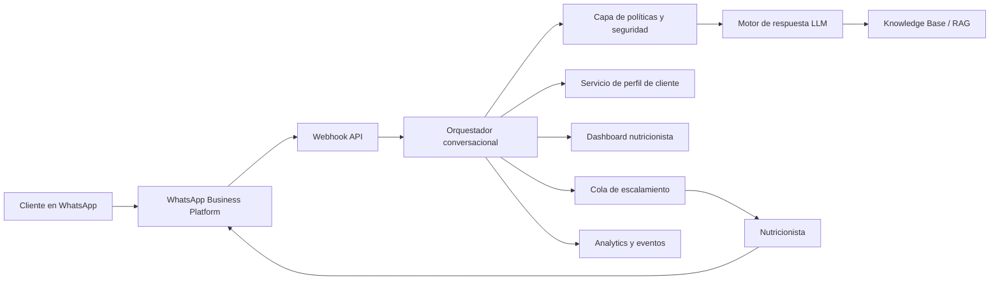

# Ejemplo FDE: Chatbot de IA por WhatsApp para Nutricionistas

Ejemplo completo usando el **FDE Ops Framework**.

Producto: **NutriAssist WhatsApp AI**
Audiencia: nutricionistas independientes, clínicas de nutrición, centros wellness y equipos pequeños de salud.
Objetivo: ayudar a nutricionistas a atender mejor y más rápido a sus clientes por WhatsApp, manteniendo siempre al profesional humano en control de las decisiones clínicas.

---

## 1. Resumen ejecutivo

Muchos nutricionistas gestionan a sus clientes manualmente por WhatsApp: recordatorios de citas, dudas sobre planes alimentarios, sustituciones de alimentos, seguimiento de adherencia, progreso semanal y preguntas frecuentes.

Esto genera problemas operativos:

* Alta carga manual.
* Respuestas lentas fuera de horario.
* Preguntas repetidas.
* Poco seguimiento estructurado de adherencia.
* Contexto disperso en chats.
* Falta de un traspaso claro desde bot a nutricionista.
* Dificultad para escalar sin contratar más asistentes.

La solución propuesta es un asistente de IA por WhatsApp que ayude a automatizar interacciones repetitivas y de bajo riesgo, mientras escala a la nutricionista los casos sensibles, clínicos o personalizados.

El asistente **no reemplaza al nutricionista**. Funciona como una capa operativa para:

* Intake inicial.
* Recordatorios de citas.
* Preguntas frecuentes sobre el plan.
* Sugerencias de sustituciones dentro de reglas aprobadas.
* Check-ins de hábitos.
* Recolección de progreso.
* Educación nutricional aprobada.
* Triage de soporte.
* Escalamiento humano.

---

## 2. Concepto del producto

### Nombre del producto

**NutriAssist WhatsApp AI**

### One-liner

Un asistente de IA por WhatsApp que ayuda a nutricionistas a gestionar comunicación con clientes, automatizar seguimientos, recolectar progreso y escalar casos que requieren juicio profesional.

### Usuarios objetivo

Usuarios principales:

* Nutricionistas independientes.
* Clínicas de nutrición pequeñas.
* Programas de coaching online.
* Centros wellness.
* Consultas de nutrición funcional.

Usuarios finales:

* Clientes de nutrición.
* Pacientes siguiendo un plan alimentario.
* Clientes fitness o wellness.
* Personas recibiendo acompañamiento de hábitos.

### Resultado de negocio esperado

Ayudar a nutricionistas a:

* Reducir mensajes repetitivos por WhatsApp.
* Mejorar adherencia de clientes.
* Aumentar velocidad de respuesta.
* Estandarizar el seguimiento.
* Capturar datos estructurados del cliente.
* Escalar el servicio sin perder supervisión humana.

---

## 3. Handoff FDE

### Brief inicial

| Campo                        | Ejemplo                                                                                    |
| ---------------------------- | ------------------------------------------------------------------------------------------ |
| Cliente                      | Clínica NutriVida                                                                          |
| Sponsor                      | Fundadora / nutricionista principal                                                        |
| Objetivo de negocio          | Reducir carga manual en WhatsApp y mejorar seguimiento de clientes                         |
| Usuarios objetivo            | 4 nutricionistas, 300 clientes activos                                                     |
| Proceso actual               | Conversaciones manuales por WhatsApp y Google Sheets                                       |
| Fecha deseada de lanzamiento | MVP en 6 semanas                                                                           |
| Riesgo principal             | Dar recomendaciones nutricionales inseguras o demasiado personalizadas sin revisión humana |
| Métrica de éxito             | Reducir en 40% los mensajes repetitivos dentro de 60 días                                  |

### Supuestos iniciales

* La clínica ya usa WhatsApp con sus clientes.
* La clínica cuenta con planes alimentarios, FAQs y datos de citas.
* El chatbot funcionará mediante WhatsApp Business Platform o un proveedor BSP.
* La IA no debe diagnosticar, prescribir ni modificar planes clínicos sin aprobación profesional.
* El nutricionista debe poder tomar el control de cualquier conversación.

---

## 4. Onboarding del cliente

### Checklist de onboarding

* [ ] Identificar sponsor.
* [ ] Identificar nutricionistas usuarios.
* [ ] Identificar responsable administrativo u operativo.
* [ ] Confirmar país y requisitos de privacidad aplicables.
* [ ] Confirmar propiedad de la cuenta de WhatsApp Business.
* [ ] Confirmar si se usará Meta Cloud API o un BSP.
* [ ] Recolectar número de teléfono aprobado para negocio.
* [ ] Definir flujo de consentimiento para clientes.
* [ ] Definir proceso de traspaso humano.
* [ ] Recolectar FAQ existente, reglas de planes alimentarios y material educativo.
* [ ] Definir qué puede y qué no puede responder la IA.
* [ ] Definir cohorte piloto.
* [ ] Definir métricas de éxito.

### Mapa de stakeholders

| Stakeholder              | Rol                           | Responsabilidad                                                     | Prioridad |
| ------------------------ | ----------------------------- | ------------------------------------------------------------------- | --------- |
| Nutricionista principal  | Sponsor                       | Define límites clínicos y aprueba contenido                         | Alta      |
| Administrador de clínica | Responsable operativo         | Gestiona horarios, plantillas y listas de clientes                  | Alta      |
| FDE                      | Responsable de implementación | Diseña, configura, prueba y despliega la solución                   | Alta      |
| Platform engineer        | Responsable técnico           | Gestiona API, webhooks, hosting y monitoreo                         | Media     |
| Revisor de compliance    | Responsable de riesgo         | Revisa privacidad, consentimiento, disclaimers y retención de datos | Alta      |
| Clientes piloto          | Usuarios finales              | Usan el chatbot y entregan feedback                                 | Media     |

---

## 5. Discovery

### Preguntas de discovery de negocio

1. ¿Qué tipos de mensajes por WhatsApp consumen más tiempo actualmente?
2. ¿Cuántos clientes activos maneja cada nutricionista?
3. ¿Cuáles son las preguntas más repetidas?
4. ¿Qué comunicación debe mantenerse exclusivamente humana?
5. ¿Qué velocidad de respuesta esperan los clientes?
6. ¿Cómo se crean y almacenan los planes alimentarios?
7. ¿Los clientes tienen planes, restricciones, alergias o condiciones distintas?
8. ¿Cómo se gestionan las citas hoy?
9. ¿Qué debería pasar cuando un cliente no está siguiendo el plan?
10. ¿Cómo define la clínica un seguimiento exitoso?

### Preguntas de discovery técnico

1. ¿La clínica ya tiene acceso a WhatsApp Business Platform?
2. ¿Se usará Meta Cloud API o un Business Solution Provider?
3. ¿Dónde están almacenados los datos de clientes?
4. ¿Dónde están almacenados los planes alimentarios?
5. ¿Existe un sistema de agenda?
6. ¿Existe un CRM?
7. ¿Existe un sistema de pagos?
8. ¿Qué integraciones son necesarias para el MVP?
9. ¿Quién administra credenciales de API y webhooks?
10. ¿Qué datos no deben almacenarse?

### Preguntas de discovery clínico y seguridad

1. ¿Qué temas están permitidos para respuestas de IA?
2. ¿Qué temas requieren escalamiento humano?
3. ¿La IA puede sugerir sustituciones de alimentos?
4. ¿Las sustituciones se basan en una lista aprobada por la clínica?
5. ¿La IA debe manejar alergias?
6. ¿La IA debe responder sobre embarazo, diabetes, trastornos alimentarios, enfermedad renal u otras condiciones de alto riesgo?
7. ¿Qué disclaimers son necesarios?
8. ¿Qué lenguaje debe usar el bot cuando no está seguro?
9. ¿Cuándo debe recomendar contactar al nutricionista?
10. ¿Qué situaciones de emergencia o red flags deben activar escalamiento inmediato?

---

## 6. Discovery Memo

```md
# Discovery Memo: NutriAssist WhatsApp AI

## Resumen ejecutivo
Clínica NutriVida quiere reducir carga manual en WhatsApp y mejorar el seguimiento de clientes usando un asistente de IA por WhatsApp. El asistente automatizará mensajes rutinarios, recolectará datos de adherencia, responderá FAQs aprobadas y escalará decisiones clínicas al nutricionista.

## Objetivo de negocio
Reducir en 40% los mensajes manuales repetitivos dentro de 60 días, manteniendo supervisión profesional segura.

## Estado actual
- Las nutricionistas responden manualmente por WhatsApp.
- El progreso del cliente se registra de forma inconsistente.
- Las dudas sobre planes alimentarios se repiten a diario.
- No hay escalamiento ni etiquetado estructurado.
- No existen métricas de tiempo de respuesta o adherencia.

## Estado objetivo
- Los clientes interactúan con un asistente por WhatsApp para solicitudes rutinarias.
- La IA responde solo dentro de límites aprobados.
- Los casos sensibles se escalan a un humano.
- Las nutricionistas reciben resúmenes estructurados.
- El progreso y la adherencia se registran en un dashboard.

## Casos de uso principales
1. Intake de nuevo cliente.
2. Recordatorio de cita.
3. FAQ sobre plan alimentario.
4. Sustitución de alimento aprobada.
5. Check-in diario o semanal de adherencia.
6. Recolección de progreso.
7. Escalamiento humano.
8. Seguimiento post-consulta.

## Restricciones
- No diagnóstico médico.
- No consejo sobre medicamentos.
- No coaching para trastornos alimentarios por IA.
- No orientación para condiciones de alto riesgo sin revisión humana.
- No modificación de planes alimentarios sin aprobación de nutricionista.
- Consentimiento del cliente obligatorio antes de mensajes automatizados.

## Alcance inicial MVP
- Bot de WhatsApp.
- Flujo de consentimiento y onboarding.
- Asistente FAQ usando contenido aprobado por la clínica.
- Explicación de plan alimentario, no generación autónoma de planes.
- Check-ins de adherencia.
- Escalamiento humano.
- Dashboard para nutricionista.

## Fuera de alcance para MVP
- Integración completa con EHR/HIS.
- Diagnóstico automatizado.
- Prescripción clínica generada por IA.
- Automatización de pagos.
- Generación completa de planes alimentarios.
- Flujos de seguros.
```

---

## 7. Alcance del MVP

### En alcance

| Feature                        | Descripción                                                        | Owner               |
| ------------------------------ | ------------------------------------------------------------------ | ------------------- |
| Onboarding de cliente          | Recolectar consentimiento, preferencias, objetivos y restricciones | FDE + nutricionista |
| Recordatorios de cita          | Enviar recordatorios y permitir confirmar o solicitar reagendar    | FDE                 |
| Asistente FAQ                  | Responder preguntas aprobadas sobre nutrición y clínica            | FDE + nutricionista |
| Explicador de plan alimentario | Explicar el plan asignado en lenguaje simple                       | FDE + nutricionista |
| Ayudante de sustitución        | Sugerir solo sustituciones aprobadas por reglas de la clínica      | Nutricionista       |
| Check-ins de adherencia        | Preguntar progreso diario o semanal                                | FDE                 |
| Escalamiento humano            | Derivar casos sensibles al nutricionista                           | FDE + admin clínica |
| Dashboard                      | Mostrar estado de clientes, riesgos y handoffs pendientes          | Platform            |
| Logs conversacionales          | Guardar resúmenes estructurados y eventos de auditoría             | Platform            |

### Fuera de alcance

| Feature                                        | Razón                                                       |
| ---------------------------------------------- | ----------------------------------------------------------- |
| Diagnóstico                                    | Requiere evaluación profesional.                            |
| Consejo sobre medicamentos                     | Alto riesgo clínico.                                        |
| Generación autónoma de tratamiento nutricional | Debe mantenerse liderado por profesional.                   |
| Manejo de emergencias                          | El bot debe escalar o recomendar ayuda profesional urgente. |
| Coaching en trastornos alimentarios            | Dominio de alto riesgo que requiere atención especializada. |
| Cambios nutricionales complejos por enfermedad | Requiere revisión humana.                                   |

---

## 8. Personas de usuario

### Persona 1: Nutricionista

Necesita:

* Ahorrar tiempo.
* Evitar responder lo mismo muchas veces.
* Mantener control sobre decisiones clínicas.
* Ver qué clientes necesitan atención.
* Mejorar adherencia.

Dolores:

* Demasiados mensajes por WhatsApp.
* Contexto disperso en chats.
* Preguntas repetidas.
* Difícil saber quién está teniendo problemas.

### Persona 2: Cliente

Necesita:

* Respuestas rápidas.
* Explicaciones simples.
* Recordatorios.
* Motivación.
* Forma fácil de contactar a su nutricionista.

Dolores:

* Olvida instrucciones del plan.
* No sabe qué sustituciones están permitidas.
* Olvida citas.
* Le da vergüenza preguntar cosas simples.

### Persona 3: Administrador de clínica

Necesita:

* Reducir coordinación manual.
* Confirmar citas.
* Seguir no-shows.
* Dar soporte a varias nutricionistas.

---

## 9. Diseño conversacional

### Menú principal

```text
Hola {{first_name}} 👋
Soy NutriAssist, el asistente de apoyo nutricional de {{clinic_name}}.

¿Cómo puedo ayudarte hoy?

1. Ver resumen de mi plan
2. Hacer una pregunta sobre mi plan
3. Solicitar una sustitución de alimento
4. Confirmar o reagendar cita
5. Enviar actualización de progreso
6. Hablar con mi nutricionista
```

### Flujo de consentimiento

```text
Antes de comenzar, por favor confirma:

Este asistente ayuda con soporte nutricional rutinario basado en información aprobada por tu nutricionista. No reemplaza la atención profesional médica ni nutricional.

Para síntomas urgentes, preocupaciones médicas, trastornos alimentarios, embarazo, medicamentos o condiciones de salud específicas, contacta directamente a tu profesional de salud o nutricionista.

¿Aceptas recibir mensajes automatizados de soporte por WhatsApp de {{clinic_name}}?

Responde SÍ para continuar.
```

### Flujo de FAQ sobre plan alimentario

```text
Cliente: ¿Puedo reemplazar arroz por papa?

Lógica del bot:
1. Identificar plan asignado.
2. Revisar tabla de sustituciones aprobadas.
3. Revisar restricciones y alergias.
4. Si está permitido, responder con equivalencia de porción.
5. Si hay incertidumbre, escalar.

Respuesta del bot:
Según tu plan actual, puedes reemplazar {{rice_portion}} por {{potato_portion}}.

Esta sustitución está basada en la lista aprobada por tu nutricionista.

¿Quieres que avise a tu nutricionista que hiciste esta sustitución hoy?
```

### Flujo de escalamiento humano

```text
Quiero asegurarme de que recibas la orientación correcta.

Esta pregunta debería revisarla tu nutricionista porque puede requerir criterio clínico personalizado.

Ya envié un resumen a {{nutritionist_name}}. Recibirás respuesta lo antes posible.
```

### Flujo de red flag

```text
Tu mensaje puede estar relacionado con una situación de salud que no debe ser manejada por un asistente automático.

Por favor contacta directamente a tu nutricionista o profesional de salud. Si los síntomas son severos o urgentes, busca atención médica de emergencia.

También marcaré esta conversación para revisión del equipo de la clínica.
```

---

## 10. Límites de seguridad de la IA

### Acciones permitidas

* Explicar contenido educativo aprobado por la clínica.
* Recordar citas.
* Hacer preguntas estructuradas de check-in.
* Resumir actualizaciones del cliente.
* Sugerir sustituciones solo desde listas aprobadas.
* Explicar el plan asignado sin modificarlo.
* Enrutar mensajes al humano correcto.
* Generar resúmenes internos para la nutricionista.

### Acciones no permitidas

* Diagnosticar condiciones.
* Prescribir dietas para enfermedades sin aprobación humana.
* Modificar planes alimentarios de forma autónoma.
* Dar consejo sobre medicamentos.
* Manejar casos de trastornos alimentarios sin escalamiento.
* Dar orientación de embarazo, pediatría o enfermedades sin supervisión.
* Recomendar dietas extremas, ayunos, suplementos o restricciones inseguras.
* Ignorar alergias, síntomas o señales de alto riesgo.

### Triggers de escalamiento

Escalar a humano si el mensaje menciona:

* Embarazo.
* Diabetes.
* Enfermedad renal.
* Cáncer.
* Trastorno alimentario.
* Restricción severa.
* Mareos, desmayos, vómitos, dolor de pecho o debilidad severa.
* Medicamentos.
* Suplementos con posibles contraindicaciones.
* Reacción alérgica.
* Nutrición infantil.
* Pérdida rápida de peso.
* Malestar emocional o psicológico.
* Solicitudes para cambiar significativamente el plan alimentario.

---

## 11. Blueprint técnico

### Arquitectura objetivo



### Componentes

| Componente                    | Responsabilidad                                                                          |
| ----------------------------- | ---------------------------------------------------------------------------------------- |
| WhatsApp Business Platform    | Canal para recibir y enviar mensajes de WhatsApp.                                        |
| Webhook API                   | Recibe eventos de WhatsApp y envía respuestas.                                           |
| Orquestador conversacional    | Gestiona estado, rutas, menús y handoff.                                                 |
| Capa de seguridad             | Aplica reglas nutricionales, médicas, de privacidad y escalamiento.                      |
| Motor LLM                     | Genera respuestas controladas usando contexto aprobado.                                  |
| Knowledge Base                | Guarda FAQs, explicaciones de planes y reglas de sustitución aprobadas.                  |
| Servicio de perfil de cliente | Guarda preferencias, restricciones, plan asignado, consentimiento y nutricionista owner. |
| Dashboard                     | Muestra conversaciones, escalaciones, adherencia y señales de riesgo.                    |
| Analytics                     | Mide uso, tiempos de respuesta, escalaciones y resultados.                               |
| Admin Panel                   | Permite administrar contenido, plantillas, usuarios y reglas.                            |

### Modelo de datos

```text
Client
- id
- name
- phone
- consent_status
- nutritionist_id
- assigned_plan_id
- allergies
- restrictions
- goals
- risk_flags
- last_checkin_at
- status

Nutritionist
- id
- name
- clinic_id
- active_clients
- notification_preferences

MealPlan
- id
- client_id
- version
- summary
- meals
- allowed_substitutions
- restricted_foods
- approved_by
- approved_at

Conversation
- id
- client_id
- channel
- status
- current_intent
- escalation_status
- last_message_at

Message
- id
- conversation_id
- sender_type
- content
- intent
- safety_classification
- created_at

Escalation
- id
- client_id
- reason
- severity
- summary
- assigned_to
- status
- created_at

CheckIn
- id
- client_id
- date
- adherence_score
- hunger_level
- energy_level
- notes
- risk_flags
```

---

## 12. Diseño de Knowledge Base

### Fuentes necesarias

| Fuente                       | Propósito                            | Owner                                |
| ---------------------------- | ------------------------------------ | ------------------------------------ |
| FAQ clínica                  | Preguntas operativas y nutricionales | Admin clínica                        |
| Glosario de plan alimentario | Explicar términos comunes            | Nutricionista                        |
| Sustituciones aprobadas      | Lógica segura de sustitución         | Nutricionista                        |
| Política de citas            | Reagendamiento, cancelación, no-show | Admin clínica                        |
| Política de seguridad        | Límites y escalamiento               | Compliance / nutricionista principal |
| Guía de tono                 | Cómo debe hablar el asistente        | Dueño de clínica                     |

### Ejemplo de tabla de sustituciones

| Original         | Sustituto aprobado | Regla de porción                    | Notas                               |
| ---------------- | ------------------ | ----------------------------------- | ----------------------------------- |
| Arroz blanco     | Papa               | 1 porción de arroz = 1 papa mediana | Solo si no hay restricción.         |
| Pechuga de pollo | Pechuga de pavo    | Mismo peso cocido                   | Evitar versiones fritas.            |
| Yogur griego     | Yogur sin lactosa  | Misma porción                       | Usar si hay intolerancia a lactosa. |
| Manzana          | Pera               | Misma unidad/tamaño                 | No reemplazar por jugo.             |
| Avena            | Pan integral       | Porción aprobada por nutricionista  | Depende del plan.                   |

---

## 13. Taxonomía de intents

| Intent                 | Ejemplo                     | Nivel de automatización                |
| ---------------------- | --------------------------- | -------------------------------------- |
| greeting               | Hola                        | Automatizado                           |
| consent                | SÍ                          | Automatizado                           |
| plan_summary           | ¿Qué debo comer hoy?        | Automatizado con plan asignado         |
| faq                    | ¿Puedo tomar café?          | Automatizado con KB                    |
| substitution           | ¿Puedo reemplazar arroz?    | Automatizado solo con reglas aprobadas |
| appointment            | ¿Puedo reagendar?           | Semi-automatizado                      |
| progress_update        | Hoy cumplí un 80%           | Captura automática                     |
| complaint              | Me siento débil             | Escalar                                |
| medical_condition      | Tengo diabetes              | Escalar                                |
| eating_disorder_signal | Quiero dejar de comer       | Escalamiento urgente                   |
| human_request          | Hablar con mi nutricionista | Escalar                                |
| out_of_scope           | Pregunta médica general     | Rechazo seguro + handoff               |

---

## 14. Patrón de prompting

### Comportamiento del motor de respuesta IA

```text
Eres un asistente de soporte nutricional para una práctica de nutrición profesional.

Ayudas a clientes a entender contenido aprobado por la clínica, recordatorios, planes alimentarios asignados y sustituciones aprobadas.

No debes diagnosticar, prescribir, modificar tratamientos, recomendar medicamentos ni dar orientación para condiciones médicas de alto riesgo.

Si un mensaje requiere juicio profesional, debes escalarlo al nutricionista.

Usa únicamente el perfil del cliente, su plan asignado, la tabla de sustituciones aprobadas y la knowledge base de la clínica.

Si la respuesta no está en el contexto aprobado, indica que la nutricionista debe revisarlo.

Responde de forma breve, cálida y clara.

Prioriza siempre la seguridad por sobre la completitud.
```

### Lógica de decisión de respuesta

```text
1. Detectar intent.
2. Verificar consentimiento.
3. Revisar perfil del cliente.
4. Revisar triggers de seguridad.
5. Si es alto riesgo, escalar.
6. Si está permitido, recuperar contexto aprobado.
7. Generar respuesta breve.
8. Registrar mensaje, intent y clasificación de seguridad.
9. Ofrecer siguiente paso.
```

---

## 15. Plantillas de mensajes WhatsApp

### Recordatorio de cita

```text
Hola {{1}}, te recordamos tu cita de nutrición con {{2}} el {{3}} a las {{4}}.

Responde:
1 para confirmar
2 para solicitar reagendar
3 para hacer una pregunta
```

### Check-in semanal

```text
Hola {{1}} 👋 Es momento de tu check-in semanal de nutrición.

¿Cómo estuvo tu adherencia esta semana?

1. Excelente
2. Buena
3. Difícil
4. Necesito ayuda
```

### Confirmación de handoff humano

```text
Gracias, {{1}}. Envié tu mensaje a {{2}} para revisión.

Recibirás una respuesta lo antes posible.
```

### Re-engagement

```text
Hola {{1}}, notamos que aún no completas tu check-in de esta semana.

¿Quieres enviar una actualización rápida ahora?

Responde SÍ para comenzar.
```

---

## 16. Plan de API e integración

### Integraciones necesarias para MVP

| Integración                      | Propósito                             | Requisito MVP     |
| -------------------------------- | ------------------------------------- | ----------------- |
| WhatsApp Business Platform o BSP | Enviar y recibir mensajes de WhatsApp | Requerido         |
| Base de clientes                 | Guardar perfil y consentimiento       | Requerido         |
| Knowledge base                   | Recuperar respuestas aprobadas        | Requerido         |
| Dashboard                        | Revisión de nutricionista y handoff   | Requerido         |
| Sistema de calendario            | Recordatorios de citas                | Opcional para MVP |
| CRM                              | Seguimiento de cuenta o cliente       | Opcional          |
| Pagos                            | Cobros, planes, suscripciones         | Fuera de alcance  |

### Eventos webhook a manejar

* Mensaje entrante.
* Respuesta de botón/lista.
* Estado de entrega.
* Estado de lectura.
* Respuesta a template.
* Opt-in / opt-out.
* Solicitud de handoff humano.

### Endpoints backend

```text
POST /webhooks/whatsapp
POST /messages/send
POST /conversations/:id/escalate
GET  /clients/:id
POST /clients/:id/checkins
GET  /dashboard/escalations
POST /kb/search
POST /admin/templates
```

---

## 17. Seguridad y privacidad

### Requisitos

* Obtener opt-in explícito antes de soporte automatizado por WhatsApp.
* Almacenar solo datos necesarios.
* Cifrar datos sensibles en reposo.
* Usar control de acceso por rol.
* Mantener logs de auditoría para cambios de contenido clínico.
* Mantener logs de auditoría para respuestas IA y escalaciones.
* Permitir opt-out de clientes.
* Definir período de retención.
* Evitar almacenar detalles de salud innecesarios en logs.
* Revisar requisitos locales de datos de salud y privacidad antes de lanzamiento.

### Clasificación de datos

| Dato               | Sensibilidad                        | Manejo                              |
| ------------------ | ----------------------------------- | ----------------------------------- |
| Número de teléfono | Dato personal                       | Cifrar y restringir acceso.         |
| Plan alimentario   | Dato personal relacionado con salud | Control estricto de acceso.         |
| Alergias           | Dato de salud                       | Usar para seguridad y escalamiento. |
| Mensajes           | Personal y potencialmente de salud  | Guardar con política de retención.  |
| Check-ins          | Datos conductuales de salud         | Aplicar minimización de datos.      |
| Outputs de IA      | Datos de auditoría                  | Mantener para revisión y mejora.    |

---

## 18. Checklist de readiness

### Readiness técnico

* [ ] Número de WhatsApp aprobado.
* [ ] Webhook recibiendo mensajes.
* [ ] Envío de mensajes probado.
* [ ] Templates aprobados.
* [ ] Estado conversacional funcionando.
* [ ] Lookup de perfil de cliente funcionando.
* [ ] Recuperación de KB funcionando.
* [ ] Escalamiento humano funcionando.
* [ ] Dashboard funcionando.
* [ ] Logs y métricas activos.
* [ ] Alertas de errores activas.

### Readiness de seguridad

* [ ] Flujo de consentimiento aprobado.
* [ ] Disclaimers aprobados.
* [ ] Triggers de alto riesgo probados.
* [ ] Handoff humano probado.
* [ ] Reglas de sustitución aprobadas.
* [ ] Respuestas fuera de alcance probadas.
* [ ] Workflow de revisión nutricionista probado.
* [ ] Red-team test completado.

### Readiness operativo

* [ ] Owner de soporte asignado.
* [ ] SLA de escalamiento definido.
* [ ] Nutricionistas capacitadas.
* [ ] Admin capacitado.
* [ ] Cohorte piloto seleccionada.
* [ ] Formulario de feedback listo.
* [ ] Rollback plan aprobado.

---

## 19. Plan de go-live

### Cohorte piloto

Comenzar con:

* 1 clínica.
* 1 a 2 nutricionistas.
* 30 a 50 clientes.
* Piloto de 2 a 4 semanas.

### Fases de lanzamiento

| Fase                   | Alcance                | Objetivo                         |
| ---------------------- | ---------------------- | -------------------------------- |
| Testing interno        | Solo equipo de clínica | Validar flujos y seguridad.      |
| Soft pilot             | 10 clientes cercanos   | Probar uso real.                 |
| Lanzamiento controlado | 30-50 clientes         | Medir reducción de carga manual. |
| Expansión              | Toda la clínica        | Escalar si KPIs se cumplen.      |

### Rollback plan

Si ocurre un problema de seguridad, privacidad o técnico:

1. Desactivar respuestas automáticas de IA.
2. Mantener WhatsApp activo para soporte humano.
3. Enviar aviso a clientes si corresponde.
4. Preservar logs para revisión.
5. Corregir causa raíz.
6. Reejecutar pruebas de readiness.
7. Relanzar solo después de aprobación.

---

## 20. Plan de hypercare

### Duración

2 a 4 semanas después del lanzamiento.

### Chequeos diarios

* Número de conversaciones.
* Escalaciones.
* Mensajes fallidos.
* Detecciones de intents inseguros.
* Tiempo de toma humana.
* Quejas de clientes.
* Fallback rate de IA.
* Preguntas frecuentes sin respuesta.

### Revisión semanal

* Actualizar FAQ.
* Actualizar tabla de sustituciones.
* Revisar escalaciones.
* Mejorar prompts.
* Mejorar templates.
* Revisar KPIs.

---

## 21. KPIs

### KPIs de negocio

| KPI                               | Meta                                        |
| --------------------------------- | ------------------------------------------- |
| Reducción de mensajes repetitivos | 40% dentro de 60 días                       |
| Tiempo promedio de respuesta      | Menos de 1 minuto para flujos automatizados |
| SLA de escalamiento humano        | Menos de 4 horas hábiles                    |
| Tasa de confirmación de citas     | +20% de mejora                              |
| Tasa de check-in semanal          | 60% o más                                   |
| Tiempo ahorrado por nutricionista | 5+ horas/semana por nutricionista           |

### KPIs de producto

| KPI                              | Meta                                     |
| -------------------------------- | ---------------------------------------- |
| Bot containment rate             | 50-70% para intents rutinarios aprobados |
| Precisión de escalamiento seguro | 95%+ para triggers de alto riesgo        |
| Fallback rate                    | Menos de 15% después del primer mes      |
| Cobertura de KB                  | 80%+ de preguntas repetidas              |
| Satisfacción del cliente         | 4.5/5 o superior                         |

### KPIs técnicos

| KPI                            | Meta                                                          |
| ------------------------------ | ------------------------------------------------------------- |
| Uptime de webhook              | 99.5%+ para MVP                                               |
| Éxito de entrega de mensajes   | 98%+                                                          |
| Latencia promedio de respuesta | Menos de 3 segundos, excluyendo restricciones propias del LLM |
| Error rate                     | Menos de 1%                                                   |
| Disponibilidad de dashboard    | 99%+                                                          |

---

## 22. Registro de riesgos

| Riesgo                                         | Impacto | Probabilidad | Mitigación                                                                   | Owner                   |
| ---------------------------------------------- | ------- | ------------ | ---------------------------------------------------------------------------- | ----------------------- |
| La IA entrega consejo nutricional inseguro     | Alto    | Media        | Capa de seguridad, KB restringida, triggers de escalamiento, revisión humana | Nutricionista principal |
| Cliente comparte información médica sensible   | Alto    | Alta         | Aviso de privacidad, minimización de datos, escalamiento                     | Compliance              |
| Rechazo de templates de WhatsApp               | Medio   | Media        | Usar templates claros de utilidad/soporte y probar temprano                  | FDE                     |
| El bot automatiza demasiado la atención humana | Alto    | Media        | Human takeover, límites de alcance y educación al cliente                    | Sponsor                 |
| Mala calidad de KB                             | Medio   | Alta         | Contenido aprobado por nutricionista y revisión semanal                      | Nutricionista           |
| Retrasos de integración                        | Medio   | Media        | MVP con integraciones mínimas primero                                        | Platform                |
| Clientes desconfían del bot                    | Medio   | Media        | Posicionarlo transparentemente como asistente de soporte                     | Dueño clínica           |
| Alto volumen de escalaciones                   | Medio   | Media        | Mejorar FAQ, routing e intent detection                                      | FDE                     |
| Riesgo regulatorio o de privacidad             | Alto    | Media        | Revisión legal/privacidad local antes de lanzamiento                         | Compliance              |

---

## 23. Runbook de soporte e incidentes

### Tipos de incidentes

| Tipo                     | Severidad | Ejemplo                                                  |
| ------------------------ | --------- | -------------------------------------------------------- |
| Respuesta insegura       | Sev 1     | Bot entrega orientación médica o nutricional incorrecta. |
| Exposición de privacidad | Sev 1     | Cliente recibe información de otro cliente.              |
| Caída de WhatsApp        | Sev 2     | Mensajes no se reciben o no se envían.                   |
| Falla de escalamiento    | Sev 2     | Handoff humano no notifica a nutricionista.              |
| Error de KB              | Sev 3     | FAQ incorrecta por contenido desactualizado.             |
| Problema de template     | Sev 3     | Recordatorio no aprobado o no enviado.                   |

### Respuesta Sev 1

1. Desactivar respuestas automáticas de IA.
2. Mantener soporte manual por WhatsApp activo.
3. Notificar canal interno de incidentes.
4. Asignar Incident Commander.
5. Exportar logs de conversación afectados.
6. Notificar owner clínico.
7. Revisar impacto.
8. Preparar comunicación a cliente si corresponde.
9. Corregir causa raíz.
10. Ejecutar pruebas de regresión de seguridad.
11. Relanzar después de aprobación.

---

## 24. Ejemplo de status semanal

```md
# Status semanal: NutriAssist WhatsApp AI

## Resumen ejecutivo
Estado: Amarillo

El MVP avanza según planificación, pero la aprobación de templates de WhatsApp y la revisión de contenido clínico son riesgos actuales. El webhook, routing conversacional y flujos FAQ ya están implementados en staging.

## Completado esta semana
- Webhook conectado al número de prueba de WhatsApp.
- Flujo de consentimiento implementado.
- Menú principal implementado.
- KB inicial cargada.
- Prototipo de cola de escalamiento creado.

## En progreso
- Revisión de tabla de sustituciones aprobadas.
- Dashboard para nutricionista.
- Aprobación de templates de WhatsApp.
- Pruebas de triggers de seguridad.

## Riesgos
| Riesgo | Impacto | Mitigación | Owner |
|---|---|---|---|
| Retraso en aprobación de templates | Retraso de lanzamiento | Enviar templates simplificados temprano | FDE |
| Reglas de sustitución incompletas | Respuestas inseguras | Desactivar flujo de sustitución hasta aprobación | Nutricionista principal |
| Alto fallback rate | Mala UX | Expandir FAQ desde preguntas piloto | FDE |

## Decisiones requeridas
- Confirmar si sustitución de alimentos entra en piloto.
- Confirmar primera cohorte piloto.
- Confirmar SLA de escalamiento.

## Próximo hito
Revisión de readiness del piloto el viernes.
```

---

## 25. Backlog de implementación

### Epic 1: Canal WhatsApp

* [ ] Crear/verificar cuenta de WhatsApp Business.
* [ ] Configurar número de teléfono.
* [ ] Configurar webhook.
* [ ] Enviar mensaje de prueba.
* [ ] Recibir mensaje de prueba.
* [ ] Configurar templates.
* [ ] Trackear estado de entrega.

### Epic 2: Motor conversacional

* [ ] Menú principal.
* [ ] Estado de consentimiento.
* [ ] Detección de intent.
* [ ] Estado conversacional.
* [ ] Manejo de fallback.
* [ ] Handoff humano.

### Epic 3: Seguridad nutricional

* [ ] Política de permitido/no permitido.
* [ ] Detección de red flags.
* [ ] Reglas de escalamiento.
* [ ] Disclaimers.
* [ ] Casos de prueba de seguridad.

### Epic 4: Knowledge base

* [ ] Ingesta de FAQ.
* [ ] Glosario de plan alimentario.
* [ ] Reglas de sustitución.
* [ ] Endpoint de retrieval.
* [ ] Flujo admin para actualizar contenido.

### Epic 5: Dashboard

* [ ] Lista de conversaciones.
* [ ] Perfil de cliente.
* [ ] Cola de escalamiento.
* [ ] Dashboard de check-ins.
* [ ] Vista de analytics.

### Epic 6: Operación piloto

* [ ] Lista de cohorte piloto.
* [ ] Capacitación de nutricionistas.
* [ ] Mensaje de onboarding para clientes.
* [ ] Recolección de feedback.
* [ ] Dashboard de hypercare.

---

## 26. Timeline sugerido

| Semana | Hito                  | Entregables                                                |
| ------ | --------------------- | ---------------------------------------------------------- |
| 1      | Discovery y alcance   | Discovery memo, alcance MVP, registro de riesgos           |
| 2      | Blueprint             | Arquitectura, modelo de datos, flujos conversacionales     |
| 3      | Build core            | Webhook WhatsApp, menú, consentimiento, flujo FAQ          |
| 4      | Seguridad y dashboard | Escalamiento, triggers de seguridad, dashboard MVP         |
| 5      | Testing               | Testing interno, aprobación de templates, red-team testing |
| 6      | Lanzamiento piloto    | 30-50 clientes, hypercare, tracking de KPIs                |

---

## 27. Definition of Done

El MVP está terminado cuando:

* Los clientes pueden dar consentimiento por WhatsApp.
* El bot puede responder FAQs aprobadas.
* El bot puede explicar información del plan asignado.
* El bot puede recolectar check-ins.
* El bot escala mensajes de alto riesgo o fuera de alcance.
* Las nutricionistas pueden ver y responder escalaciones.
* Existen logs y métricas.
* Los casos de prueba de seguridad pasan.
* El rollback plan está documentado.
* La cohorte piloto está lanzada.

---

## 28. Recomendación final

Construir esto como un **asistente para atención liderada por nutricionistas**, no como una IA nutricional autónoma.

El MVP más seguro es:

1. Intake y consentimiento por WhatsApp.
2. Recordatorios de citas.
3. FAQ aprobada por la clínica.
4. Explicación de plan alimentario.
5. Check-ins de adherencia.
6. Escalamiento humano.
7. Dashboard para nutricionistas.
8. Analytics y mejora continua.

Evitar decisiones clínicas autónomas en la primera versión.

El sistema debe ayudar a las nutricionistas a escalar la comunicación manteniendo juicio profesional, seguridad y confianza del cliente en el centro.
