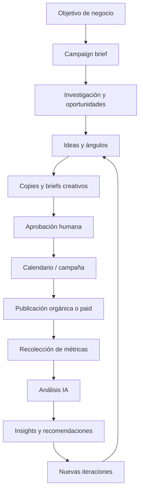
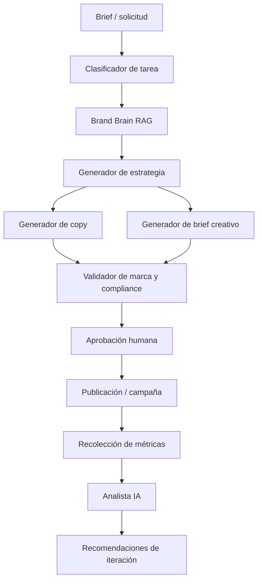

# Ejemplo FDE: Sistema de IA para Automatizar Redes Sociales, Campañas y Análisis de Resultados

Ejemplo completo usando el **FDE Ops Framework**.

Producto: **Social Growth AI Ops**
Audiencia: equipos de marketing, agencias, founders, community managers, growth teams y pymes B2B/B2C.
Objetivo: automatizar la planificación, creación, publicación, análisis e iteración de contenido orgánico y campañas pagadas en redes sociales usando IA, manteniendo control humano sobre estrategia, marca, presupuesto y cumplimiento.

---

## 1. Resumen ejecutivo

Los equipos de marketing suelen operar redes sociales con procesos manuales y fragmentados:

* Ideas en documentos sueltos.
* Calendarios editoriales en planillas.
* Creatividades en Canva/Figma.
* Copies escritos manualmente.
* Publicación en varias plataformas.
* Campañas pagadas gestionadas desde Ads Manager.
* Resultados analizados tarde y sin conexión con las decisiones creativas.

Esto genera problemas:

* Baja velocidad de producción.
* Inconsistencia de marca.
* Poco aprendizaje entre campañas.
* Duplicación de trabajo entre orgánico y paid.
* Falta de trazabilidad entre hipótesis, piezas, presupuesto y resultados.
* Reportes manuales.
* Iteración lenta.

La solución propuesta es un sistema de IA que actúe como una capa operativa para marketing:

1. Investigar oportunidades de contenido.
2. Generar campañas y ángulos creativos.
3. Crear posts, captions, anuncios y variaciones.
4. Organizar calendario editorial.
5. Preparar assets para aprobación humana.
6. Publicar o preparar publicación.
7. Conectar resultados de plataformas orgánicas y pagadas.
8. Analizar rendimiento.
9. Recomendar iteraciones.
10. Crear aprendizajes reutilizables.

El sistema no debe reemplazar al estratega, marketer o director creativo. Debe funcionar como un **Marketing Ops Copilot** con revisión humana, guardrails de marca y medición constante.

---

## 2. Concepto del producto

### Nombre del producto

**Social Growth AI Ops**

### One-liner

Un sistema de IA que ayuda a equipos de marketing a crear, publicar, medir e iterar contenido orgánico y campañas pagadas en redes sociales desde un flujo operativo único.

### Usuarios objetivo

Usuarios principales:

* Growth marketers.
* Community managers.
* Paid media managers.
* Equipos de marketing B2B.
* Agencias de marketing.
* Founders o equipos pequeños.
* Equipos de contenido.

Usuarios secundarios:

* Diseñadores.
* Directores creativos.
* Sales / revenue teams.
* Customer success.
* Equipo ejecutivo.

### Resultado de negocio esperado

Ayudar al equipo a:

* Producir más contenido de calidad en menos tiempo.
* Reducir trabajo repetitivo.
* Mantener consistencia de marca.
* Aumentar velocidad de experimentación.
* Conectar paid y organic en un mismo sistema de aprendizaje.
* Mejorar CAC, ROAS, CTR, engagement y conversión.
* Generar reportes automáticos.
* Aprender qué mensajes, formatos, audiencias y canales funcionan mejor.

---

## 3. Handoff FDE

### Brief inicial

| Campo                | Ejemplo                                                                                        |
| -------------------- | ---------------------------------------------------------------------------------------------- |
| Cliente              | GrowthLab Agency                                                                               |
| Sponsor              | Head of Growth                                                                                 |
| Objetivo de negocio  | Aumentar producción e iteración de campañas sociales usando IA                                 |
| Usuarios objetivo    | 3 marketers, 2 diseñadores, 1 paid media manager                                               |
| Proceso actual       | Ideas en Notion, diseños en Canva, campañas en Meta/LinkedIn/TikTok, reportes en Sheets        |
| Fecha deseada de MVP | 6 a 8 semanas                                                                                  |
| Riesgo principal     | Publicar contenido fuera de marca, incorrecto o sin aprobación                                 |
| Métrica de éxito     | Reducir 50% el tiempo de producción de campañas y aumentar 20% la velocidad de experimentación |

### Supuestos iniciales

* El equipo ya tiene cuentas de redes sociales activas.
* El equipo publica contenido orgánico y corre campañas pagadas.
* El equipo tiene alguna guía de marca, aunque sea informal.
* Las publicaciones y campañas deben pasar por aprobación humana.
* La IA puede generar borradores, variaciones y análisis, pero no debe publicar ni gastar presupuesto sin aprobación.
* El sistema debe operar con trazabilidad entre idea, asset, campaña, plataforma y resultado.

---

## 4. Onboarding del cliente

### Checklist de onboarding

* [ ] Identificar sponsor.
* [ ] Identificar usuarios principales: marketing, paid, diseño, aprobación.
* [ ] Identificar canales sociales en alcance.
* [ ] Confirmar plataformas orgánicas: Instagram, Facebook, LinkedIn, TikTok, X, YouTube Shorts, etc.
* [ ] Confirmar plataformas pagadas: Meta Ads, LinkedIn Ads, TikTok Ads, Google Ads, etc.
* [ ] Recolectar brand guidelines.
* [ ] Recolectar ejemplos de contenido exitoso y no exitoso.
* [ ] Recolectar productos, servicios y propuestas de valor.
* [ ] Recolectar audiencias y buyer personas.
* [ ] Recolectar objetivos de campañas.
* [ ] Recolectar acceso a datos de rendimiento.
* [ ] Definir proceso de aprobación.
* [ ] Definir qué puede automatizarse y qué requiere aprobación humana.
* [ ] Definir métricas de éxito.
* [ ] Definir primer piloto.

### Mapa de stakeholders

| Stakeholder          | Rol                     | Responsabilidad                                         | Prioridad  |
| -------------------- | ----------------------- | ------------------------------------------------------- | ---------- |
| Head of Growth       | Sponsor                 | Define objetivos, presupuesto y prioridades             | Alta       |
| Content lead         | Owner orgánico          | Define calendario, formatos y temas                     | Alta       |
| Paid media manager   | Owner paid              | Define campañas, audiencias, presupuesto y optimización | Alta       |
| Brand/Creative lead  | Owner de marca          | Aprueba tono, estética y coherencia visual              | Alta       |
| FDE                  | Owner de implementación | Diseña, integra, prueba y despliega el sistema          | Alta       |
| Data/Analytics owner | Owner de medición       | Define tracking, dashboards y reporting                 | Media      |
| Legal/Compliance     | Reviewer                | Revisa claims, regulaciones, disclaimers y permisos     | Media/Alta |

---

## 5. Discovery

### Preguntas de discovery de negocio

1. ¿Qué objetivo principal tiene el sistema: awareness, leads, ventas, retención o comunidad?
2. ¿Qué productos o servicios se promocionarán?
3. ¿Qué audiencias son prioritarias?
4. ¿Qué canales generan mejor rendimiento hoy?
5. ¿Qué tipos de contenido funcionan mejor?
6. ¿Qué campañas pagadas han funcionado y por qué?
7. ¿Cuál es el ciclo actual de creación y aprobación?
8. ¿Cuánto tiempo toma producir una campaña completa?
9. ¿Qué reportes se revisan hoy?
10. ¿Qué decisiones se toman a partir de esos reportes?

### Preguntas de discovery creativo

1. ¿Cuál es la voz de marca?
2. ¿Qué palabras o claims están prohibidos?
3. ¿Qué tono debe usar la marca: experto, cercano, técnico, humorístico, aspiracional?
4. ¿Qué formatos se usan: carruseles, reels, stories, newsletters, clips, ads estáticos, UGC?
5. ¿Existen plantillas visuales?
6. ¿Qué ejemplos representan bien la marca?
7. ¿Qué ejemplos no deben repetirse?
8. ¿Qué competidores o referentes inspiran el contenido?
9. ¿Qué temas son sensibles?
10. ¿Qué nivel de personalización por canal se necesita?

### Preguntas de discovery técnico

1. ¿Dónde se gestionará el calendario editorial?
2. ¿Dónde se guardarán assets y copies?
3. ¿Qué herramientas se usan: Notion, Airtable, Google Sheets, Canva, Figma, HubSpot, Shopify, GA4?
4. ¿Qué APIs están disponibles?
5. ¿Quién aprueba permisos de redes sociales y ads?
6. ¿Qué datos se pueden extraer automáticamente?
7. ¿Qué datos requieren export manual?
8. ¿Cómo se identifican campañas, UTM y conversiones?
9. ¿Hay pixel, conversion API o server-side tracking?
10. ¿Qué datos no se deben enviar al proveedor de IA?

---

## 6. Discovery Memo

```md
# Discovery Memo: Social Growth AI Ops

## Resumen ejecutivo
El equipo quiere automatizar la operación de contenido orgánico y campañas pagadas usando IA. El sistema debe ayudar a investigar ideas, generar campañas, crear copies y variantes, organizar calendario, analizar rendimiento y recomendar iteraciones, manteniendo aprobación humana antes de publicar o invertir presupuesto.

## Objetivo de negocio
Reducir 50% el tiempo de producción de campañas y aumentar 20% la velocidad de experimentación en 90 días.

## Estado actual
- Ideas dispersas en Notion y chats.
- Calendario editorial manual.
- Copies creados desde cero por marketers.
- Diseños creados manualmente en Canva/Figma.
- Paid y organic se analizan por separado.
- Reportes manuales en Sheets.
- Aprendizajes no se convierten en sistema reutilizable.

## Estado objetivo
- Briefs estructurados por campaña.
- IA genera ángulos, hooks, copies, variantes y briefs visuales.
- Calendario editorial centralizado.
- Flujo de aprobación humano.
- Integración de resultados orgánicos y pagados.
- Análisis semanal automático.
- Recomendaciones de iteración por canal, audiencia, formato y mensaje.

## Casos de uso principales
1. Generación de calendario editorial.
2. Creación de posts orgánicos.
3. Creación de campañas pagadas.
4. Variantes de copy y creatividad.
5. Análisis de resultados orgánicos.
6. Análisis de resultados pagados.
7. Recomendaciones de iteración.
8. Reporte semanal ejecutivo.
9. Base de aprendizajes de marketing.

## Restricciones
- No publicar automáticamente sin aprobación.
- No activar campañas ni modificar presupuesto sin aprobación.
- No usar claims no comprobados.
- No usar datos personales sensibles en prompts.
- No copiar contenido protegido o de competidores.
- Mantener trazabilidad de fuente, campaña, asset y resultado.
```

---

## 7. Alcance del MVP

### En alcance

| Feature                  | Descripción                                                         | Owner              |
| ------------------------ | ------------------------------------------------------------------- | ------------------ |
| Brand brain              | Base de conocimiento de marca, tono, productos, audiencias y reglas | Marketing + FDE    |
| Campaign brief generator | Crea briefs estructurados de campaña                                | FDE                |
| Content idea engine      | Genera ideas por objetivo, canal, audiencia y etapa funnel          | FDE                |
| Copy generator           | Crea captions, hooks, headlines, CTAs y variantes                   | FDE                |
| Creative brief generator | Crea instrucciones para diseño, UGC o video                         | FDE + diseño       |
| Calendar planner         | Organiza contenido orgánico por semana/canal                        | Content lead       |
| Paid campaign planner    | Propone estructura de campaña pagada                                | Paid media manager |
| Approval workflow        | Estados: draft, review, approved, scheduled, published              | FDE                |
| Analytics connector      | Trae métricas de redes y campañas                                   | Data owner         |
| Performance analyzer     | Detecta ganadores, perdedores e insights                            | FDE + IA           |
| Iteration engine         | Sugiere nuevos tests basados en resultados                          | Growth lead        |
| Weekly report            | Genera reporte ejecutivo y operativo                                | FDE                |

### Fuera de alcance MVP

| Feature                                | Razón                                          |
| -------------------------------------- | ---------------------------------------------- |
| Publicación automática sin aprobación  | Riesgo de marca y compliance.                  |
| Optimización automática de presupuesto | Alto riesgo financiero.                        |
| Generación autónoma de claims          | Riesgo legal y reputacional.                   |
| Creación completa de video final       | Requiere assets, edición y revisión humana.    |
| MMM avanzado                           | Requiere más datos históricos.                 |
| Atribución perfecta cross-platform     | Alta complejidad y limitaciones de privacidad. |

---

## 8. Personas de usuario

### Persona 1: Content marketer

Necesita:

* Ideas constantes.
* Copies rápidos.
* Calendario organizado.
* Adaptación por canal.
* Menos trabajo repetitivo.

Dolores:

* Bloqueo creativo.
* Reescribir lo mismo para cada red.
* Poca claridad sobre qué funcionó.
* Feedback tardío.

### Persona 2: Paid media manager

Necesita:

* Variantes de anuncios.
* Ángulos claros por audiencia.
* Testing estructurado.
* Reportes de performance.
* Recomendaciones accionables.

Dolores:

* Muchas variantes manuales.
* Resultados dispersos.
* Creatividades fatigadas.
* Dificultad para convertir aprendizajes en nuevos tests.

### Persona 3: Creative lead

Necesita:

* Mantener consistencia visual.
* Revisar piezas rápido.
* Tener briefs claros.
* Evitar piezas fuera de marca.

Dolores:

* Briefs incompletos.
* Cambios de último minuto.
* Demasiadas solicitudes urgentes.

### Persona 4: Founder / executive

Necesita:

* Saber qué está funcionando.
* Ver impacto en negocio.
* Entender próximos experimentos.
* No revisar dashboards complejos.

---

## 9. Diseño del flujo operativo

### Flujo general



### Estados de contenido

| Estado    | Descripción                                | Owner             |
| --------- | ------------------------------------------ | ----------------- |
| Idea      | Concepto inicial sin copy final            | Content/Growth    |
| Draft     | Copy o brief creado por IA                 | IA + marketer     |
| Review    | En revisión humana                         | Content lead      |
| Approved  | Aprobado para publicación o campaña        | Brand/Marketing   |
| Scheduled | Programado en calendario                   | Community manager |
| Published | Publicado o lanzado                        | Channel owner     |
| Measured  | Métricas recolectadas                      | Data owner        |
| Iterated  | Aprendizaje convertido en nueva pieza/test | Growth lead       |

---

## 10. Stack tecnológico recomendado

Esta decisión vive dentro del **Blueprint técnico** como un **Stack Decision Record**.

### Stack MVP recomendado

| Capa                    | Recomendación                                  | Justificación                                                              |
| ----------------------- | ---------------------------------------------- | -------------------------------------------------------------------------- |
| Frontend / dashboard    | Next.js                                        | Dashboard rápido para calendario, aprobación, assets, insights y reportes. |
| Backend                 | FastAPI o NestJS                               | APIs, webhooks, workers, integración con plataformas y orquestación IA.    |
| Base de datos           | PostgreSQL                                     | Campañas, posts, assets, métricas, aprobaciones, usuarios y auditoría.     |
| Vector DB               | pgvector                                       | Suficiente para brand brain, knowledge base, ejemplos y aprendizajes.      |
| Jobs / colas            | Redis + Celery/BullMQ                          | Recolección de métricas, generación programada, reportes y sincronización. |
| Storage                 | S3 compatible                                  | Guardar assets, exports, briefs, thumbnails y reportes.                    |
| Analytics interno       | PostHog                                        | Medir uso del sistema, funnels y adopción interna.                         |
| BI / reporting          | Metabase, Looker Studio o Superset             | Dashboards de paid, organic, campañas e insights.                          |
| Integraciones orgánicas | APIs de plataformas o herramienta social media | Publicación, métricas y calendario.                                        |
| Integraciones paid      | Meta Ads, LinkedIn Ads, TikTok Ads, Google Ads | Métricas, campañas, anuncios, gasto y conversiones.                        |
| Web analytics           | GA4 + UTMs                                     | Medición de tráfico, conversiones y campañas.                              |
| Diseño                  | Canva, Figma o generación de imágenes          | Producción visual y plantillas.                                            |
| Observabilidad          | Sentry + OpenTelemetry                         | Errores, latencia, fallos de APIs, jobs y calidad operativa.               |

### Decisión práctica para MVP

```md
## Stack MVP

- Dashboard: Next.js
- Backend: FastAPI
- DB: PostgreSQL + pgvector
- Queue: Redis + Celery
- Storage: S3 compatible
- AI provider: OpenAI / Anthropic / Gemini según costo, calidad y disponibilidad
- Image generation: modelo de imagen o integración con Canva/Figma
- Reporting: Metabase o Looker Studio
- Product analytics: PostHog
- Web analytics: GA4
- Observability: Sentry + OpenTelemetry
- Organic publishing: herramienta existente o APIs disponibles
- Paid analytics: conectores Meta/LinkedIn/TikTok/Google Ads
```

---

## 11. Modelos de IA recomendados

No usar un solo modelo para todo. Usar arquitectura multi-modelo.

### Arquitectura de IA



### Tipos de modelos

| Uso                      | Tipo de modelo                           | Criterio de elección                                                |
| ------------------------ | ---------------------------------------- | ------------------------------------------------------------------- |
| Generar estrategia       | Modelo de razonamiento fuerte            | Mejor para campaign angles, hipótesis, segmentación y priorización. |
| Generar copy             | Modelo rápido y económico                | Alto volumen de variantes, captions, headlines y CTAs.              |
| Validar marca/compliance | Modelo fuerte + reglas determinísticas   | Detectar claims prohibidos, tono incorrecto o riesgos.              |
| Resumir resultados       | Modelo rápido                            | Reportes semanales, resúmenes de métricas y comentarios.            |
| Analizar performance     | Modelo de razonamiento + Python/SQL      | Detectar patrones, ganadores, fatiga creativa y próximos tests.     |
| Embeddings               | Modelo de embeddings                     | Buscar en brand brain, campañas pasadas, aprendizajes y FAQs.       |
| Imagen                   | Modelo de imagen o herramienta de diseño | Mockups, conceptos visuales, thumbnails, storyboards.               |
| Video                    | Generación o edición asistida            | Futuro, no obligatorio para MVP.                                    |

### Recomendación por etapa

| Etapa | IA recomendada                                                                 |
| ----- | ------------------------------------------------------------------------------ |
| MVP   | LLM texto + embeddings + reglas de marca + análisis SQL/Python.                |
| V1    | Agregar generación de imágenes para mockups y variaciones visuales.            |
| V2    | Agregar video briefs, UGC scripts, análisis de comentarios y social listening. |
| V3    | Agregar optimización semiautomática de presupuesto con aprobación humana.      |

### Regla clave

La IA puede proponer, generar, analizar y recomendar.
La IA no debe publicar, gastar presupuesto ni modificar campañas críticas sin aprobación humana.

---

## 12. Brand Brain

El **Brand Brain** es la base de conocimiento que la IA usa para mantener coherencia.

### Contenido mínimo

| Documento         | Propósito                                                    |
| ----------------- | ------------------------------------------------------------ |
| Brand guidelines  | Voz, tono, estilo visual, colores, tipografía, personalidad. |
| Producto/servicio | Qué vende la empresa y cómo explicarlo.                      |
| Buyer personas    | Audiencias, dolores, motivaciones, objeciones.               |
| Claims aprobados  | Mensajes permitidos.                                         |
| Claims prohibidos | Mensajes que no deben usarse.                                |
| Competidores      | Referentes, diferenciadores y riesgos de copia.              |
| Campañas pasadas  | Qué se hizo y cómo rindió.                                   |
| Top posts         | Ejemplos de contenido ganador.                               |
| Malos ejemplos    | Qué evitar.                                                  |
| Guía por canal    | Cómo adaptar contenido a cada red.                           |

### Estructura sugerida

```text
brand-brain/
├── brand-guidelines.md
├── product-messaging.md
├── buyer-personas.md
├── approved-claims.md
├── forbidden-claims.md
├── channel-playbooks/
│   ├── instagram.md
│   ├── linkedin.md
│   ├── tiktok.md
│   └── meta-ads.md
├── campaigns-history.md
├── winning-posts.md
└── learnings.md
```

---

## 13. Taxonomía de contenido

### Por objetivo

| Objetivo       | Ejemplos de contenido                                             |
| -------------- | ----------------------------------------------------------------- |
| Awareness      | Educación, tendencias, storytelling, POV, memes de industria.     |
| Engagement     | Preguntas, encuestas, controversias sanas, carruseles guardables. |
| Consideración  | Comparativas, casos de uso, problemas comunes, objeciones.        |
| Conversión     | Oferta, demo, prueba social, CTA directo, lead magnet.            |
| Retención      | Tips, novedades, educación, comunidad, casos de clientes.         |
| Employer brand | Cultura, equipo, behind the scenes, aprendizajes internos.        |

### Por formato

| Formato            | Uso recomendado                             |
| ------------------ | ------------------------------------------- |
| Carrusel           | Educación, frameworks, listas, paso a paso. |
| Reel / short video | Alcance, storytelling, hooks rápidos.       |
| Post estático      | Anuncio, quote, promoción, recordatorio.    |
| Story              | Interacción rápida, backstage, encuestas.   |
| LinkedIn post      | POV, liderazgo de pensamiento, casos B2B.   |
| Ad estático        | Performance, ofertas claras, retargeting.   |
| UGC script         | Prueba social, producto en uso, objeciones. |
| Landing copy       | Conversión y consistencia con paid.         |

---

## 14. Flujo de generación de campañas

### Input mínimo

```md
# Campaign Brief Input

## Objetivo
- Awareness / Leads / Ventas / Retención:

## Producto o servicio

## Audiencia

## Oferta

## Canales
- Orgánico:
- Pagado:

## Presupuesto paid

## Fecha de inicio y término

## Restricciones de marca

## Claims obligatorios

## Claims prohibidos

## Métrica principal

## Métricas secundarias
```

### Output esperado

```md
# Campaign Plan

## Resumen ejecutivo

## Hipótesis de campaña

## Audiencia objetivo

## Mensajes principales

## Ángulos creativos
| Ángulo | Insight | Promesa | Riesgo | Canal recomendado |
|---|---|---|---|---|

## Assets requeridos
| Asset | Formato | Canal | Owner | Fecha |
|---|---|---|---|---|

## Plan orgánico

## Plan paid

## Experimentos

## KPIs

## Riesgos

## Próximos pasos
```

---

## 15. Ejemplo de campaña generada

### Brief

```md
## Objetivo
Generar leads para una consultoría B2B de automatización con IA.

## Audiencia
Founders y heads of operations de empresas de 10 a 100 empleados.

## Oferta
Diagnóstico gratuito de automatización en 30 minutos.

## Canales
- LinkedIn orgánico.
- Meta Ads retargeting.
- LinkedIn Ads para prospección B2B.

## Métrica principal
Costo por lead calificado.
```

### Plan de campaña

| Elemento    | Propuesta                                                                                                         |
| ----------- | ----------------------------------------------------------------------------------------------------------------- |
| Hipótesis   | Los equipos operativos sienten que la IA es útil, pero no saben por dónde empezar ni cómo priorizar casos de uso. |
| Promesa     | Identificar 3 automatizaciones de alto impacto en 30 minutos.                                                     |
| Ángulo 1    | “Tu equipo no necesita más herramientas, necesita menos trabajo repetitivo.”                                      |
| Ángulo 2    | “La IA no falla por tecnología, falla por falta de proceso.”                                                      |
| Ángulo 3    | “Antes de comprar software, mapea tus cuellos de botella.”                                                        |
| CTA         | Agenda un diagnóstico gratuito.                                                                                   |
| Lead magnet | Checklist de automatización operativa.                                                                            |

### Variantes de copy orgánico

```md
## LinkedIn Post 1
La mayoría de empresas no tiene un problema de IA.
Tiene un problema de procesos invisibles.

Antes de automatizar, necesitas responder:

1. ¿Qué tareas se repiten cada semana?
2. ¿Qué decisiones dependen de información dispersa?
3. ¿Qué procesos se frenan por aprobaciones manuales?
4. ¿Qué reportes nadie quiere preparar?
5. ¿Qué errores se repiten aunque el equipo ya los conoce?

La IA funciona mejor cuando se conecta a un proceso claro.

Estamos ofreciendo un diagnóstico gratuito de 30 minutos para identificar 3 automatizaciones de alto impacto.

Comenta “IA” y te envío el link.
```

```md
## LinkedIn Post 2
No empieces tu estrategia de IA preguntando “qué herramienta compramos”.

Empieza preguntando:

¿Qué trabajo repetitivo queremos eliminar?

Esa pregunta cambia todo.

Porque la IA no se implementa bien como experimento aislado.
Se implementa bien cuando reduce fricción real del negocio.

Si quieres, estamos haciendo diagnósticos gratuitos de automatización para equipos de operaciones.
```

### Variantes de anuncios paid

| Variante | Headline                      | Primary text                                                                              | CTA                   |
| -------- | ----------------------------- | ----------------------------------------------------------------------------------------- | --------------------- |
| A        | Automatiza trabajo repetitivo | Identifica 3 procesos que podrías automatizar con IA en 30 minutos.                       | Agendar diagnóstico   |
| B        | IA práctica para operaciones  | Deja de probar herramientas sueltas. Descubre dónde la IA realmente puede ahorrar tiempo. | Reservar hora         |
| C        | Menos tareas manuales         | Te mostramos oportunidades concretas de automatización en tu operación actual.            | Solicitar diagnóstico |

---

## 16. Flujo de aprobación

### Estados

```text
Idea -> Draft IA -> Revisión marketing -> Revisión marca/legal -> Aprobado -> Programado -> Publicado -> Medido -> Iterado
```

### Checklist de aprobación

* [ ] El mensaje está alineado con el objetivo de campaña.
* [ ] El tono respeta la marca.
* [ ] No hay claims no comprobados.
* [ ] El CTA es claro.
* [ ] El formato se adapta al canal.
* [ ] La pieza tiene UTM si corresponde.
* [ ] El asset visual está aprobado.
* [ ] El presupuesto paid está aprobado.
* [ ] La fecha de publicación está definida.

---

## 17. Plan orgánico

### Calendario semanal ejemplo

| Día       | Canal             | Formato     | Tema                                | Objetivo      | Owner     | Estado    |
| --------- | ----------------- | ----------- | ----------------------------------- | ------------- | --------- | --------- |
| Lunes     | LinkedIn          | Post texto  | POV de automatización               | Awareness     | Content   | Draft     |
| Martes    | Instagram         | Carrusel    | 5 procesos que puedes automatizar   | Engagement    | Diseño    | Review    |
| Miércoles | TikTok/Reels      | Short video | Error común implementando IA        | Awareness     | Creative  | Idea      |
| Jueves    | LinkedIn          | Caso de uso | Automatización de reportes          | Consideración | Content   | Draft     |
| Viernes   | Instagram Stories | Encuesta    | ¿Qué tarea te gustaría automatizar? | Engagement    | Community | Scheduled |

### Métricas orgánicas

| Métrica         | Uso                             |
| --------------- | ------------------------------- |
| Alcance         | Medir distribución.             |
| Impresiones     | Medir exposición total.         |
| Engagement rate | Medir resonancia.               |
| Guardados       | Medir valor percibido.          |
| Compartidos     | Medir viralidad o utilidad.     |
| Comentarios     | Medir conversación.             |
| Clicks          | Medir intención.                |
| Leads orgánicos | Medir conversión.               |
| Follower growth | Medir crecimiento de audiencia. |

---

## 18. Plan paid media

### Estructura de campaña MVP

```text
Campaign: AI Automation Diagnostic
├── Ad Set 1: Founders B2B
│   ├── Ad A: Pain angle
│   ├── Ad B: Opportunity angle
│   └── Ad C: Process angle
├── Ad Set 2: Operations Leaders
│   ├── Ad A: Time-saving angle
│   ├── Ad B: Reporting automation angle
│   └── Ad C: Bottleneck angle
└── Retargeting
    ├── Ad A: Case study
    ├── Ad B: Reminder
    └── Ad C: Direct CTA
```

### Métricas paid

| Métrica                      | Uso                                   |
| ---------------------------- | ------------------------------------- |
| Spend                        | Control de presupuesto.               |
| Impressions                  | Volumen de entrega.                   |
| CPM                          | Costo de exposición.                  |
| CTR                          | Relevancia del anuncio.               |
| CPC                          | Costo de tráfico.                     |
| CVR                          | Conversión post-click.                |
| CPL                          | Costo por lead.                       |
| CPA                          | Costo por adquisición.                |
| ROAS                         | Retorno sobre inversión publicitaria. |
| Frequency                    | Fatiga publicitaria.                  |
| Quality/relevance indicators | Calidad de anuncio y audiencia.       |

### Guardrails paid

* No aumentar presupuesto automáticamente sin aprobación.
* No pausar campañas automáticamente sin aviso.
* No crear audiencias sensibles sin revisión.
* No usar claims no aprobados.
* No mezclar aprendizajes sin considerar audiencia, canal y objetivo.
* No declarar ganador sin suficiente volumen.

---

## 19. Tracking y UTMs

### Convención UTM

```text
utm_source={{platform}}
utm_medium={{organic|paid_social}}
utm_campaign={{campaign_name}}
utm_content={{creative_angle}}_{{format}}_{{variant}}
utm_term={{audience_or_adset}}
```

### Ejemplo

```text
https://example.com/diagnostico-ia?utm_source=linkedin&utm_medium=paid_social&utm_campaign=ai_automation_diagnostic&utm_content=process_angle_static_a&utm_term=ops_leaders
```

### Reglas

* Toda pieza con link debe tener UTM.
* Cada variante debe tener `utm_content` único.
* Cada audiencia/ad set debe tener `utm_term` claro.
* Las campañas deben usar naming convention consistente.
* Las conversiones deben conectarse con GA4, CRM o sistema de leads.

---

## 20. Analytics y análisis de resultados

### Modelo de datos analítico

```text
Campaign
- id
- name
- objective
- start_date
- end_date
- owner
- budget
- status

Creative
- id
- campaign_id
- channel
- format
- angle
- hook
- copy
- visual_concept
- status

Post
- id
- creative_id
- platform
- publish_date
- url
- organic_metrics

Ad
- id
- creative_id
- platform
- campaign_id
- adset_id
- spend
- impressions
- clicks
- conversions

Insight
- id
- campaign_id
- finding
- evidence
- recommendation
- confidence
- created_at
```

### Reporte semanal automático

```md
# Weekly Social Growth Report

## Resumen ejecutivo

## Qué funcionó

## Qué no funcionó

## Top posts orgánicos
| Post | Canal | Formato | Métrica ganadora | Insight |
|---|---|---|---|---|

## Top anuncios paid
| Ad | Plataforma | Audiencia | Spend | CTR | CPL | Insight |
|---|---|---|---|---|---|---|

## Aprendizajes

## Recomendaciones

## Experimentos para la próxima semana

## Riesgos o decisiones pendientes
```

---

## 21. Iteration engine

El sistema debe convertir resultados en nuevas hipótesis.

### Tipos de insight

| Insight            | Ejemplo                                     | Acción sugerida                           |
| ------------------ | ------------------------------------------- | ----------------------------------------- |
| Mensaje ganador    | “Menos trabajo repetitivo” generó mejor CTR | Crear 5 nuevas variantes sobre ese dolor. |
| Formato ganador    | Carruseles tuvieron más guardados           | Convertir mejores posts en carruseles.    |
| Audiencia ganadora | Ops leaders tuvieron CPL menor              | Aumentar presupuesto con aprobación.      |
| Hook débil         | Video con baja retención inicial            | Reescribir primeros 3 segundos.           |
| Fatiga creativa    | Frequency alta y CTR cayendo                | Crear nuevas piezas o rotar ángulo.       |
| Conversión débil   | Buen CTR pero bajo CVR                      | Revisar landing y promesa.                |

### Reglas de iteración

* Si un post orgánico tiene alto engagement, proponer versión paid.
* Si un ad tiene buen CTR pero bajo CVR, revisar landing o expectativa del anuncio.
* Si un ángulo gana en paid, proponer contenido orgánico educativo sobre ese ángulo.
* Si un comentario se repite, convertirlo en post, FAQ o nuevo ad.
* Si la frecuencia sube y el CTR baja, generar nuevas creatividades.
* Si un formato gana consistentemente, aumentar producción de ese formato.

---

## 22. Prompts base

### Prompt para generar campaña

```text
Actúa como strategist de growth marketing.

Usa el brand brain, buyer personas, campañas pasadas y objetivo del brief.

Crea una campaña con:
- hipótesis
- audiencia
- propuesta de valor
- ángulos creativos
- mensajes principales
- plan orgánico
- plan paid
- experimentos
- KPIs
- riesgos

No inventes claims que no estén aprobados.
Si falta información crítica, marca supuestos.
```

### Prompt para copy orgánico

```text
Actúa como content strategist.

Crea 5 variantes de post para {{channel}} usando:
- objetivo: {{objective}}
- audiencia: {{audience}}
- ángulo: {{angle}}
- tono de marca: {{brand_voice}}
- CTA: {{cta}}

Cada variante debe incluir:
- hook
- cuerpo
- CTA
- formato recomendado
- riesgo de marca si aplica
```

### Prompt para paid ads

```text
Actúa como paid media creative strategist.

Crea variantes de anuncio para {{platform}}.

Incluye:
- headline
- primary text
- description si aplica
- CTA
- ángulo
- audiencia
- hipótesis
- métrica esperada

Respeta claims aprobados y evita promesas absolutas.
```

### Prompt para análisis semanal

```text
Actúa como growth analyst.

Analiza los resultados de campañas orgánicas y pagadas.

Identifica:
- ganadores
- perdedores
- señales de fatiga
- oportunidades de iteración
- riesgos de medición
- próximos experimentos

No declares ganador si el volumen de datos es insuficiente.
Distingue entre correlación y causalidad.
```

---

## 23. Seguridad, compliance y marca

### Riesgos principales

| Riesgo                           | Mitigación                                                            |
| -------------------------------- | --------------------------------------------------------------------- |
| Claims falsos o exagerados       | Lista de claims aprobados/prohibidos + revisión humana.               |
| Contenido fuera de marca         | Brand validator + aprobación creativa.                                |
| Uso indebido de datos personales | Minimización de datos y reglas de privacidad.                         |
| Sesgo o segmentación sensible    | Revisión de audiencias y compliance.                                  |
| Publicación accidental           | Estados de aprobación y permisos separados.                           |
| Gasto accidental                 | No permitir cambios automáticos de presupuesto.                       |
| Copia de competidores            | Usar competidores solo como referencia estratégica, no copiar piezas. |
| Reportes engañosos               | Mostrar volumen, ventana de medición y confianza.                     |

### Checklist de compliance

* [ ] Claims aprobados.
* [ ] Claims prohibidos cargados.
* [ ] Reglas de tono cargadas.
* [ ] Audiencias sensibles revisadas.
* [ ] Uso de datos personales validado.
* [ ] Derechos de imagen y assets confirmados.
* [ ] Aprobación humana antes de publicar.
* [ ] Aprobación humana antes de invertir presupuesto.
* [ ] Registro de cambios y aprobaciones activo.

---

## 24. Readiness checklist

### Readiness técnico

* [ ] Brand Brain cargado.
* [ ] Generación de briefs funcionando.
* [ ] Generación de copies funcionando.
* [ ] Generación de briefs creativos funcionando.
* [ ] Approval workflow funcionando.
* [ ] Base de campañas funcionando.
* [ ] Métricas orgánicas conectadas o importables.
* [ ] Métricas paid conectadas o importables.
* [ ] UTMs estandarizadas.
* [ ] Dashboard inicial funcionando.
* [ ] Logs y errores monitoreados.

### Readiness operativo

* [ ] Owners definidos.
* [ ] Calendario piloto definido.
* [ ] Canales piloto definidos.
* [ ] Proceso de revisión acordado.
* [ ] SLA de aprobación definido.
* [ ] Naming convention definida.
* [ ] Reporte semanal acordado.
* [ ] Backlog de experimentos creado.

### Readiness de marca

* [ ] Tono validado.
* [ ] Ejemplos buenos cargados.
* [ ] Ejemplos malos cargados.
* [ ] Claims prohibidos cargados.
* [ ] Guía visual referenciada.
* [ ] Checklist de aprobación validado.

---

## 25. Go-live plan

### Piloto recomendado

Duración: 4 semanas.

Alcance:

* 1 marca.
* 2 canales orgánicos.
* 1 plataforma paid.
* 1 campaña principal.
* 3 ángulos creativos.
* 10 a 20 piezas orgánicas.
* 6 a 12 variantes paid.
* Reporte semanal automático.

### Fases

| Fase                 | Objetivo                                             | Duración |
| -------------------- | ---------------------------------------------------- | -------- |
| Setup                | Cargar brand brain, conectar datos, definir workflow | Semana 1 |
| Generación           | Crear campaña, copies, briefs y calendario           | Semana 2 |
| Lanzamiento          | Publicar orgánico y activar paid con aprobación      | Semana 3 |
| Análisis e iteración | Medir, aprender y generar nuevas variantes           | Semana 4 |

### Rollback plan

Si ocurre un problema:

1. Pausar publicación automática o programada.
2. Pausar campañas pagadas si hay riesgo financiero o de marca.
3. Marcar assets afectados.
4. Revisar logs de generación y aprobación.
5. Corregir reglas de marca o prompts.
6. Reaprobar piezas.
7. Relanzar con control humano.

---

## 26. Hypercare

### Duración

2 a 4 semanas después del piloto.

### Revisión diaria

* Piezas generadas.
* Piezas aprobadas.
* Piezas rechazadas.
* Motivos de rechazo.
* Errores de tono o claims.
* Performance inicial.
* Problemas de integración.

### Revisión semanal

* Top contenidos.
* Top anuncios.
* Peores contenidos.
* Aprendizajes.
* Nuevos experimentos.
* Ajustes al brand brain.
* Ajustes a prompts.
* Ajustes al calendario.

---

## 27. KPIs

### KPIs de eficiencia

| KPI                                | Meta inicial    |
| ---------------------------------- | --------------- |
| Tiempo para crear campaña          | -50% en 90 días |
| Tiempo para crear variante de copy | -70%            |
| Tiempo de reporte semanal          | -80%            |
| Piezas generadas por semana        | +100%           |
| Tiempo de aprobación               | -30%            |

### KPIs orgánicos

| KPI                       | Meta inicial |
| ------------------------- | ------------ |
| Engagement rate           | +15%         |
| Guardados                 | +20%         |
| Compartidos               | +15%         |
| Clicks orgánicos          | +20%         |
| Crecimiento de seguidores | +10% mensual |
| Leads orgánicos           | +15%         |

### KPIs paid

| KPI             | Meta inicial                                   |
| --------------- | ---------------------------------------------- |
| CTR             | +15%                                           |
| CPC             | -10%                                           |
| CPL             | -15%                                           |
| CPA             | -10%                                           |
| ROAS            | +10%                                           |
| Fatiga creativa | Detectada antes de caída fuerte de performance |

### KPIs del sistema de IA

| KPI                             | Meta inicial |
| ------------------------------- | ------------ |
| Tasa de aprobación de drafts IA | 70%+         |
| Tasa de rechazo por tono        | Menor a 15%  |
| Tasa de rechazo por claims      | Menor a 5%   |
| Fallback por falta de contexto  | Menor a 20%  |
| Insights accionables por semana | 5+           |

---

## 28. Registro de riesgos

| Riesgo                                     | Impacto | Probabilidad | Mitigación                                                     | Owner          |
| ------------------------------------------ | ------- | ------------ | -------------------------------------------------------------- | -------------- |
| IA genera contenido fuera de marca         | Alto    | Media        | Brand Brain, validator y aprobación humana                     | Creative lead  |
| IA genera claim falso                      | Alto    | Media        | Claims aprobados/prohibidos + revisión legal                   | Compliance     |
| Métricas incompletas por APIs              | Medio   | Alta         | Conectores alternativos y export manual en MVP                 | Data owner     |
| Paid y organic se comparan incorrectamente | Medio   | Media        | Separar objetivos, ventanas y métricas                         | Growth lead    |
| Se optimiza por vanity metrics             | Medio   | Alta         | Conectar métricas a leads, revenue o conversiones              | Sponsor        |
| Fatiga creativa no detectada               | Medio   | Media        | Monitor de frequency, CTR y CPA                                | Paid manager   |
| Aprobaciones lentas bloquean operación     | Medio   | Alta         | SLA de aprobación y estados claros                             | Marketing ops  |
| Dependencia excesiva de IA                 | Alto    | Media        | Revisión humana y aprendizajes documentados                    | Head of Growth |
| Costos de IA suben por alto volumen        | Medio   | Media        | Usar modelos baratos para volumen y fuertes solo para análisis | FDE            |

---

## 29. Runbook de incidentes

### Tipos de incidentes

| Tipo                   | Severidad | Ejemplo                                       |
| ---------------------- | --------- | --------------------------------------------- |
| Publicación incorrecta | Sev 1     | Se publica claim falso o contenido sensible.  |
| Gasto no autorizado    | Sev 1     | Campaña se activa con presupuesto incorrecto. |
| Error de marca grave   | Sev 2     | Pieza fuera de tono o visualmente incorrecta. |
| Error de tracking      | Sev 2     | UTMs o conversiones mal configuradas.         |
| Reporte incorrecto     | Sev 3     | Dashboard muestra métricas duplicadas.        |
| Fallo de generación    | Sev 4     | IA no genera variantes por falta de contexto. |

### Respuesta Sev 1

1. Pausar publicación o campaña afectada.
2. Notificar canal interno.
3. Asignar Incident Commander.
4. Capturar pieza, campaña, presupuesto y logs.
5. Evaluar impacto público o financiero.
6. Preparar comunicación si corresponde.
7. Corregir reglas, prompts o permisos.
8. Revisar flujo de aprobación.
9. Documentar postmortem.
10. Agregar test preventivo.

---

## 30. Backlog de implementación

### Epic 1: Brand Brain

* [ ] Crear estructura de knowledge base.
* [ ] Cargar brand guidelines.
* [ ] Cargar buyer personas.
* [ ] Cargar productos y servicios.
* [ ] Cargar claims aprobados.
* [ ] Cargar claims prohibidos.
* [ ] Cargar ejemplos de posts ganadores.
* [ ] Crear embeddings.

### Epic 2: Campaign generator

* [ ] Crear template de campaign brief.
* [ ] Crear generador de hipótesis.
* [ ] Crear generador de ángulos.
* [ ] Crear generador de plan orgánico.
* [ ] Crear generador de plan paid.
* [ ] Crear generador de experimentos.

### Epic 3: Content generator

* [ ] Crear generador de captions.
* [ ] Crear generador de hooks.
* [ ] Crear generador de CTAs.
* [ ] Crear generador de briefs visuales.
* [ ] Crear adaptador por canal.
* [ ] Crear validador de marca.

### Epic 4: Workflow y aprobación

* [ ] Crear estados de contenido.
* [ ] Crear roles y permisos.
* [ ] Crear comentarios/revisión.
* [ ] Crear historial de cambios.
* [ ] Crear aprobación final.

### Epic 5: Analytics

* [ ] Definir naming convention.
* [ ] Definir UTM builder.
* [ ] Conectar GA4.
* [ ] Conectar datos paid.
* [ ] Conectar datos orgánicos.
* [ ] Crear dashboard.
* [ ] Crear reporte semanal automático.

### Epic 6: Iteration engine

* [ ] Detectar ganadores.
* [ ] Detectar fatiga creativa.
* [ ] Detectar hooks débiles.
* [ ] Recomendar nuevos tests.
* [ ] Actualizar learning base.

---

## 31. Timeline sugerido

| Semana | Hito                     | Entregables                                       |
| ------ | ------------------------ | ------------------------------------------------- |
| 1      | Discovery y alcance      | Discovery memo, MVP scope, riesgos, KPIs          |
| 2      | Blueprint                | Arquitectura, stack, modelos IA, workflow y datos |
| 3      | Brand Brain + generación | KB, prompts, generador de campaña y copies        |
| 4      | Approval + calendario    | Dashboard, estados, revisión y calendario         |
| 5      | Analytics                | Conectores, UTMs, métricas, reporte semanal       |
| 6      | Piloto                   | Primera campaña orgánica + paid medida            |
| 7      | Iteración                | Insights, nuevas variantes, ajustes de prompts    |
| 8      | Handoff                  | Runbooks, documentación y plan de escalamiento    |

---

## 32. Definition of Done

El MVP está terminado cuando:

* El Brand Brain está cargado.
* El sistema genera campaign briefs.
* El sistema genera copies por canal.
* El sistema genera briefs creativos.
* Existe flujo de aprobación.
* Existe calendario editorial.
* Existen UTMs consistentes.
* Se recolectan métricas orgánicas y paid.
* Se genera reporte semanal.
* La IA propone iteraciones basadas en datos.
* Hay runbook para incidentes de marca, presupuesto y tracking.
* Se ejecutó al menos una campaña piloto completa.

---

## 33. Recomendación final

Construir esto como un **sistema de Marketing AI Ops**, no como un generador aislado de posts.

El MVP más útil es:

1. Brand Brain.
2. Campaign brief generator.
3. Generador de contenido por canal.
4. Generador de briefs creativos.
5. Flujo de aprobación.
6. Calendario editorial.
7. Conexión de métricas orgánicas y pagadas.
8. Reporte semanal automático.
9. Motor de iteración.

La clave no es solo crear más contenido.
La clave es crear un loop completo:

```text
hipótesis -> contenido -> campaña -> medición -> aprendizaje -> nueva iteración
```

Ese loop convierte la IA en un sistema de crecimiento, no solo en una herramienta de copywriting.
