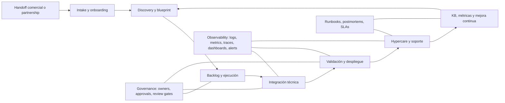
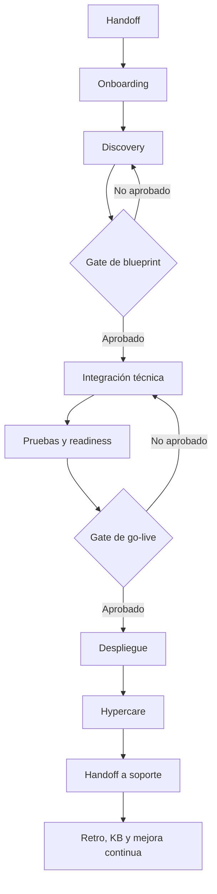

# FDE Ops Framework

Framework operativo para gestionar, acelerar y estandarizar el trabajo de un **Forward Deployed Engineer**.

Este repositorio define un sistema práctico para llevar una cuenta, implementación o proyecto técnico desde el handoff inicial hasta producción, hypercare, soporte y mejora continua.

---

## Tabla de contenidos

* [Resumen](#resumen)
* [Objetivo](#objetivo)
* [Principios](#principios)
* [Estructura recomendada del repositorio](#estructura-recomendada-del-repositorio)
* [Modelo operativo](#modelo-operativo)
* [Roles y responsabilidades](#roles-y-responsabilidades)
* [Ciclo de trabajo FDE](#ciclo-de-trabajo-fde)
* [Módulos del framework](#módulos-del-framework)
* [Checklists operativos](#checklists-operativos)
* [Plantillas MVP](#plantillas-mvp)
* [Métricas y KPIs](#métricas-y-kpis)
* [Gobernanza](#gobernanza)
* [Stack recomendado](#stack-recomendado)
* [Roadmap de implementación](#roadmap-de-implementación)
* [Riesgos y mitigaciones](#riesgos-y-mitigaciones)
* [Referencias](#referencias)

---

## Resumen

El rol de un **Forward Deployed Engineer** combina ingeniería, consultoría técnica, discovery con clientes, arquitectura de solución, integración, despliegue, soporte inicial y mejora continua.

Este framework busca convertir ese trabajo en un sistema repetible, medible y escalable.

En lugar de depender de documentos sueltos, conversaciones dispersas o decisiones informales, el framework propone una forma estructurada de operar:

1. Entender el problema del cliente.
2. Diseñar una solución técnicamente viable.
3. Gestionar dependencias, riesgos y stakeholders.
4. Ejecutar integraciones y despliegues con trazabilidad.
5. Acompañar el go-live con observabilidad y soporte.
6. Convertir aprendizajes en mejoras del sistema.

El objetivo final es reducir fricción, acelerar el tiempo a valor y mejorar la calidad operativa del trabajo FDE.

---

## Objetivo

Crear un sistema de gestión que permita a un Forward Deployed Engineer:

* Reducir el tiempo desde handoff hasta kickoff.
* Acelerar el tiempo a primer valor para el cliente.
* Estandarizar discovery, integración, despliegue y soporte.
* Evitar trabajo repetitivo mediante plantillas y automatización.
* Mejorar visibilidad del estado de cada cuenta o proyecto.
* Documentar decisiones, riesgos, incidentes y aprendizajes.
* Medir desempeño técnico y operativo con KPIs claros.
* Escalar el trabajo FDE sin depender solo de conocimiento individual.

---

## Principios

| Principio                         | Aplicación práctica                                                                  |
| --------------------------------- | ------------------------------------------------------------------------------------ |
| Outcome first                     | Cada proyecto debe declarar el objetivo de negocio y el resultado esperado.          |
| Discovery antes de construir      | No se implementa sin entender actores, sistemas, restricciones y riesgos.            |
| Source of truth explícita         | Todo debe vivir en repo, tickets, documentación o knowledge base.                    |
| Automatizar el trabajo repetitivo | Formularios, templates, pipelines y checklists deben reducir toil.                   |
| Observabilidad desde el inicio    | Logs, métricas, traces, dashboards y alertas son parte del go-live.                  |
| Gobernanza liviana                | Gates, approvals, owners y revisiones deben existir sin burocracia excesiva.         |
| Mejora continua                   | Cada incidente, bloqueo o repetición debe mejorar plantillas, docs o automatización. |

---

## Estructura recomendada del repositorio

```text
fde-ops-framework/
├── README.md
├── docs/
│   ├── onboarding-cliente.md
│   ├── discovery.md
│   ├── blueprint-tecnico.md
│   ├── despliegue-y-hypercare.md
│   ├── soporte-e-incidentes.md
│   └── metricas-y-gobernanza.md
├── templates/
│   ├── ticket-intake.md
│   ├── runbook.md
│   ├── email-kickoff.md
│   ├── email-status-semanal.md
│   ├── email-incidente.md
│   ├── sow.md
│   └── cronograma.md
├── runbooks/
│   ├── deploy.md
│   ├── rollback.md
│   ├── integracion-api.md
│   └── acceso-y-secretos.md
├── governance/
│   ├── raci.md
│   ├── severity-priority-matrix.md
│   ├── review-gates.md
│   └── documentation-owners.md
├── automation/
│   ├── issue-templates/
│   ├── pull-request-template.md
│   └── workflows/
└── metrics/
    ├── kpi-catalog.md
    └── dashboards/
```

---

## Modelo operativo

El framework organiza el trabajo FDE en cuatro capas:

1. **Entrada y orquestación del trabajo**
   Intake, handoff, discovery, priorización, tickets, cadencia y stakeholders.

2. **Ejecución técnica**
   Arquitectura, integración, código, infraestructura, datos, accesos, pruebas y despliegue.

3. **Operación y soporte**
   Hypercare, incidentes, runbooks, SLAs, knowledge base y handoff a soporte.

4. **Gobernanza y mejora continua**
   KPIs, gates, documentación, retrospectivas, postmortems y automatización.



---

## Roles y responsabilidades

| Rol                                    | Mandato principal                                     | Responsabilidades                                                                        |
| -------------------------------------- | ----------------------------------------------------- | ---------------------------------------------------------------------------------------- |
| FDE Lead                               | Responsable del outcome de la cuenta o implementación | Liderar onboarding, discovery, plan, riesgos, dependencias, cadencia y go-live.          |
| FDE                                    | Ejecutar la solución técnica                          | Traducir requerimientos en backlog, implementar, validar, documentar y operar hypercare. |
| Platform / SRE                         | Garantizar confiabilidad operativa                    | CI/CD, infraestructura, observabilidad, rollback, runbooks y alerting.                   |
| Engineering Manager / Delivery Manager | Quitar bloqueos y gobernar capacidad                  | Priorización, staffing, escalamiento, hitos y salud del portfolio.                       |
| Security / Compliance                  | Reducir riesgo regulatorio y de acceso                | Revisión de permisos, secretos, seguridad, approvals y políticas.                        |
| Support / CS / Ops                     | Sostener continuidad después del go-live              | SLAs, knowledge base, handoff operativo y feedback desde tickets.                        |
| Sponsor del cliente                    | Definir prioridad de negocio                          | Objetivo, alcance, aceptación y decisiones críticas.                                     |
| Admin / IT del cliente                 | Habilitar ejecución técnica                           | Accesos, SSO, redes, datos, ambientes y restricciones internas.                          |

### Roles mínimos en incidentes críticos

Para incidentes severos, definir al menos:

* **Incident Commander:** coordina la respuesta y toma decisiones operativas.
* **Technical Lead:** investiga causa técnica y ejecuta mitigación.
* **Customer Liaison:** comunica estado, impacto y próximos pasos al cliente.

Regla: en incidentes críticos debe existir un solo owner operativo por rol.

---

## Ciclo de trabajo FDE



### Fases

| Fase        | Objetivo                                    | Salida esperada                                                  |
| ----------- | ------------------------------------------- | ---------------------------------------------------------------- |
| Handoff     | Recibir contexto comercial o estratégico    | Ticket maestro, objetivo inicial y stakeholders.                 |
| Onboarding  | Preparar el engagement                      | Canales, accesos, calendario, riesgos y owners.                  |
| Discovery   | Entender problema, sistemas y restricciones | Discovery memo, mapa de dependencias y backlog inicial.          |
| Blueprint   | Diseñar solución ejecutable                 | Arquitectura, plan técnico, criterios de aceptación y riesgos.   |
| Integración | Construir o configurar solución             | Código, configuración, infraestructura, pruebas y documentación. |
| Readiness   | Confirmar preparación para producción       | Checklist go-live, observabilidad, rollback y aprobaciones.      |
| Go-live     | Desplegar solución                          | Producción activa, smoke tests y monitoreo.                      |
| Hypercare   | Acompañar estabilización                    | Incidentes gestionados, soporte activo y feedback.               |
| Handoff     | Transferir operación continua               | KB, runbooks, SLAs y responsabilidades claras.                   |
| Mejora      | Aprender y optimizar                        | Postmortems, métricas y backlog de mejoras.                      |

---

## Módulos del framework

| Módulo              | Propósito                                            | Entregables mínimos                                                           |
| ------------------- | ---------------------------------------------------- | ----------------------------------------------------------------------------- |
| Onboarding cliente  | Alinear objetivos, actores, accesos y cadencia       | Ficha de cuenta, matriz de stakeholders, canales y riesgos iniciales.         |
| Discovery           | Entender problema, inventario y restricciones        | Discovery memo, dependency map, backlog inicial y criterios de aceptación.    |
| Blueprint técnico   | Traducir discovery a diseño ejecutable               | Arquitectura objetivo, plan de integración, datos, accesos y plan de pruebas. |
| Despliegue          | Llevar solución a staging y producción               | Pipeline, checklist go-live, rollback y approvals.                            |
| Hypercare y soporte | Sostener lanzamiento y absorber incidentes iniciales | Runbooks, severity matrix, handoff y timeline de incidentes.                  |
| Documentación y KB  | Reducir escalaciones y preservar conocimiento        | Troubleshooting articles, guías operativas, FAQs y known issues.              |
| Métricas y mejora   | Medir delivery, confiabilidad y adopción             | Dashboard KPIs, retro y backlog de mejoras.                                   |
| Comunicación        | Estandarizar mensajes internos y externos            | Templates de kickoff, status, riesgos, incidentes y cierre.                   |

---

## Checklists operativos

### Checklist de onboarding cliente

* [ ] Definir sponsor, product owner y administrador técnico del cliente.
* [ ] Registrar objetivo de negocio, alcance inicial y definición de éxito.
* [ ] Acordar canal oficial de coordinación.
* [ ] Acordar canal de escalación.
* [ ] Crear ticket maestro, proyecto y espacio documental.
* [ ] Levantar prerequisitos de acceso, seguridad, entornos y datos.
* [ ] Alinear severidades, ventanas de cambio y disponibilidad de stakeholders.
* [ ] Crear borrador de SOW y cronograma base.
* [ ] Abrir registro de riesgos y dependencias externas.

### Checklist de discovery

* [ ] Obtener inventario de sistemas, integraciones, APIs, datos y owners.
* [ ] Mapear dependencias técnicas y operativas.
* [ ] Identificar restricciones de seguridad, latencia, auditoría, residencia y continuidad.
* [ ] Traducir problema en casos de uso priorizados.
* [ ] Definir criterios de aceptación.
* [ ] Definir definition of done.
* [ ] Decidir qué se configura, qué se construye y qué se pospone.
* [ ] Producir blueprint técnico.
* [ ] Revisar blueprint en gate formal antes de ejecutar.

### Checklist de integración técnica

* [ ] Provisionar repositorio, owners, plantillas y reglas de revisión.
* [ ] Crear o validar entornos.
* [ ] Crear o validar secretos y permisos.
* [ ] Implementar pipeline base.
* [ ] Definir estrategia de despliegue.
* [ ] Definir instrumentación de logs, métricas y traces.
* [ ] Crear dashboards mínimos.
* [ ] Preparar pruebas funcionales, de integración y smoke tests.
* [ ] Validar contratos con sistemas externos.
* [ ] Redactar runbook de deploy.
* [ ] Redactar runbook de rollback.
* [ ] Registrar deuda técnica y exclusiones del MVP.

### Checklist de despliegue

* [ ] Confirmar aprobaciones técnicas.
* [ ] Confirmar aprobaciones de negocio.
* [ ] Confirmar aprobaciones de seguridad.
* [ ] Ejecutar dry run o despliegue en staging.
* [ ] Confirmar dashboards y alertas.
* [ ] Confirmar canales de incidente.
* [ ] Verificar readiness de soporte e hypercare.
* [ ] Comunicar ventana de cambio, impacto esperado y rollback plan.
* [ ] Ejecutar smoke tests post-deploy.
* [ ] Documentar resultados y desviaciones.
* [ ] Marcar inicio de hypercare.

### Checklist de soporte y cierre

* [ ] Crear artículos de troubleshooting para errores previsibles.
* [ ] Establecer SLA y severidad por tipo de incidente o solicitud.
* [ ] Registrar incidentes con causa, mitigación y acciones de seguimiento.
* [ ] Ejecutar retro o postmortem sin culpa.
* [ ] Actualizar KB y runbooks.
* [ ] Medir tiempo a valor, tiempo a producción, defectos y reaperturas.
* [ ] Formalizar handoff a soporte o customer success.
* [ ] Cerrar SOW o hito con criterios de aceptación explícitos.

---

## Plantillas MVP

### Template de ticket de intake FDE

```md
# Intake FDE

## Datos de cuenta
- Cliente:
- Sponsor:
- Product owner:
- Admin técnico:
- Tipo de engagement: onboarding / discovery / integración / despliegue / soporte

## Objetivo de negocio
- Problema que se quiere resolver:
- KPI de negocio afectado:
- Fecha objetivo:
- Riesgo si no se resuelve:

## Contexto técnico
- Producto / módulo involucrado:
- Sistemas externos:
- Datos / APIs:
- Requisitos de seguridad:
- Entornos necesarios:

## Definición de éxito
- Criterios de aceptación:
- Evidencia esperada:
- Stakeholder que valida:

## Riesgos y dependencias
- Riesgo principal:
- Dependencias externas:
- Bloqueadores actuales:

## Próximo paso
- Owner:
- Fecha:
- Entregable:
```

### Template de runbook operativo

```md
# Runbook operativo

## Propósito
Qué resuelve este runbook y cuándo debe usarse.

## Alcance
Servicios, módulos, entornos y exclusiones.

## Señales de activación
Alertas, síntomas, queries, logs o reportes del cliente.

## Diagnóstico rápido
1. Verificar dashboard principal.
2. Confirmar estado de dependencias.
3. Revisar errores recientes.
4. Revisar cambios desplegados.
5. Clasificar severidad e impacto.

## Mitigación inmediata
- Acción A:
- Acción B:
- Acción C:

## Rollback
- Criterio para ejecutar rollback:
- Pasos exactos:
- Validación posterior:

## Escalación
- Incident Commander:
- Responsable técnico:
- Customer Liaison:
- Canal de war room:
- Tiempo máximo antes de escalar:

## Validación de cierre
- Smoke test:
- KPI normalizado:
- Confirmación del cliente:
- Ticket / incidente relacionado:
```

### Template de SOW

```md
# Statement of Work

## Objetivo

## Alcance incluido

## Alcance excluido

## Entregables

## Supuestos

## Dependencias del cliente

## Roles y responsabilidades

## Criterios de aceptación

## Riesgos y mitigaciones

## Seguridad, accesos y cumplimiento

## Cronograma e hitos

## Modelo de soporte y hypercare

## Gestión de cambios

## Firma / aprobación
```

### Template de status semanal

```md
# Status semanal

## Resumen ejecutivo
- Cliente:
- Estado general: verde / amarillo / rojo
- Semana:
- Owner FDE:

## Avances
-

## Riesgos y bloqueos
-

## Decisiones requeridas
-

## Cambios de alcance
-

## Próximo hito
- Hito:
- Fecha:
- Criterio de salida:

## Acciones pendientes
| Acción | Owner | Fecha | Estado |
|---|---|---|---|
| | | | |
```

### Template de incidente

```md
# Incidente

## Resumen
- Cliente:
- Servicio afectado:
- Severidad:
- Estado: investigando / mitigando / monitoreando / resuelto
- Hora de inicio:
- Hora de detección:
- Hora de resolución:

## Impacto
- Usuarios afectados:
- Funcionalidad afectada:
- Impacto de negocio:

## Roles
- Incident Commander:
- Technical Lead:
- Customer Liaison:

## Timeline
| Hora | Evento | Owner |
|---|---|---|
| | | |

## Mitigación
-

## Causa raíz
-

## Acciones de seguimiento
| Acción | Owner | Fecha | Estado |
|---|---|---|---|
| | | | |

## Comunicación al cliente
- Última actualización enviada:
- Próxima actualización:
```

### Template de cronograma

| Semana | Hito                 | Owner            | Dependencias              | Criterio de salida                   |
| ------ | -------------------- | ---------------- | ------------------------- | ------------------------------------ |
| 1      | Kickoff y onboarding | FDE Lead         | Sponsor y accesos         | Ficha de cuenta y canales definidos. |
| 2      | Discovery terminado  | FDE + cliente    | Inventario y stakeholders | Blueprint aprobado.                  |
| 3-4    | Integración base     | FDE + Platform   | Entornos y secretos       | Pipeline y observabilidad activos.   |
| 5      | UAT / readiness      | FDE + PO cliente | Casos de prueba           | Checklist go-live completo.          |
| 6      | Go-live + hypercare  | FDE + soporte    | Aprobaciones              | Servicio estable y handoff iniciado. |

---

## Métricas y KPIs

El framework mide tres dimensiones:

1. **Delivery:** qué tan rápido y predecible se entrega valor.
2. **Confiabilidad:** qué tan estable y recuperable es la solución.
3. **Adopción:** qué tanto valor real obtiene el cliente.

| KPI                             | Qué mide                                                      | Objetivo inicial sugerido                 | Owner                         |
| ------------------------------- | ------------------------------------------------------------- | ----------------------------------------- | ----------------------------- |
| Tiempo a kickoff                | Días desde handoff hasta kickoff formal                       | Menor o igual a 5 días hábiles            | FDE Lead                      |
| Tiempo a primer valor           | Días hasta primera capacidad útil para el cliente             | Menor o igual a 30 días                   | FDE Lead                      |
| Tiempo a producción             | Días hasta primer go-live                                     | 45 a 60 días                              | FDE Lead + Platform           |
| Change lead time                | Tiempo desde commit hasta producción                          | Reducir continuamente                     | Platform                      |
| Deployment frequency            | Frecuencia de despliegue                                      | Medir por servicio                        | Platform                      |
| Failed deployment recovery time | Tiempo de recuperación tras despliegue fallido                | Menor a 4 horas para incidentes críticos  | Platform / Incident Commander |
| Change fail rate                | Porcentaje de cambios que causan hotfix, rollback o incidente | Menor a 15% como punto de partida         | Engineering / Platform        |
| Cumplimiento de SLA             | Porcentaje de tickets dentro del objetivo                     | Mayor a 95%                               | Support / Ops                 |
| MTTA                            | Tiempo medio hasta atención inicial                           | Menor a 15 minutos en incidentes críticos | Support / On-call             |
| Reapertura de tickets           | Calidad real de resolución                                    | Menor a 10%                               | Support                       |
| Deflexión por KB                | Dudas resueltas sin escalar a humano                          | Aumentar 20% en el primer ciclo           | Support / Docs                |
| Frescura documental             | Porcentaje de docs revisadas en ventana definida              | Mayor a 90%                               | Owners de documentación       |

---

## Gobernanza

La gobernanza del framework debe ser liviana, práctica y accionable.

### Gates mínimos

| Gate               | Cuándo ocurre               | Qué valida                                                     |
| ------------------ | --------------------------- | -------------------------------------------------------------- |
| Gate de onboarding | Antes de discovery profundo | Objetivo, stakeholders, accesos, canales y riesgos iniciales.  |
| Gate de blueprint  | Antes de construir          | Arquitectura, alcance, criterios de aceptación y dependencias. |
| Gate de readiness  | Antes de go-live            | Pruebas, observabilidad, rollback, soporte y aprobaciones.     |
| Gate de handoff    | Al cierre de hypercare      | KB, runbooks, SLAs, ownership y métricas.                      |

### Cadencia recomendada

| Cadencia                       | Reunión / control         | Participantes                         | Salida                                 |
| ------------------------------ | ------------------------- | ------------------------------------- | -------------------------------------- |
| Diario durante delivery activo | Daily de blockers         | FDE, Platform, owner cliente          | Bloqueos y próximas 24 horas.          |
| Semanal                        | Status review con cliente | FDE Lead, sponsor, PO cliente         | Estado, riesgos y decisiones.          |
| Fin de discovery               | Gate de blueprint         | FDE Lead, Platform, Security, manager | Aprobar o corregir blueprint.          |
| Pre go-live                    | Gate de readiness         | FDE, Platform, Support, PO cliente    | Autorización de despliegue.            |
| Post incidente / post go-live  | Retro o postmortem        | Equipo extendido                      | Acciones de mejora.                    |
| Mensual                        | Framework review          | Managers y owners de módulo           | Mejoras de plantillas, KPIs y tooling. |

---

## Stack recomendado

El stack debe adaptarse a la realidad de cada organización. Esta es una configuración base para un equipo B2B SaaS.

### Opción repo-first

| Dominio                               | Herramientas sugeridas                            |
| ------------------------------------- | ------------------------------------------------- |
| Repositorio y source of truth técnico | GitHub                                            |
| Gestión de trabajo                    | GitHub Projects, Linear o Jira                    |
| CI/CD                                 | GitHub Actions                                    |
| Infraestructura como código           | OpenTofu o Terraform                              |
| Kubernetes / GitOps                   | Argo CD, solo si ya existe Kubernetes             |
| Observabilidad                        | OpenTelemetry + Prometheus + Grafana, o Datadog   |
| Service desk                          | Jira Service Management o alternativa equivalente |
| Knowledge base                        | Confluence, Notion o docs en repo                 |
| Comunicación                          | Slack o Microsoft Teams                           |

### Variante Microsoft-first

| Dominio            | Herramientas sugeridas           |
| ------------------ | -------------------------------- |
| Repositorio        | Azure Repos o GitHub             |
| Gestión de trabajo | Azure Boards                     |
| CI/CD              | Azure Pipelines o GitHub Actions |
| Observabilidad     | Azure Monitor                    |
| Comunicación       | Microsoft Teams                  |
| Documentación      | SharePoint, Confluence o Notion  |

### Recomendación práctica

Para el MVP, elegir una fuente primaria por dominio:

* **Código:** GitHub o Azure Repos.
* **Trabajo:** Jira, Linear, GitHub Projects o Azure Boards.
* **Documentación:** Confluence, Notion o repo.
* **Soporte:** Jira Service Management o equivalente.
* **Comunicación:** Slack o Teams.
* **Métricas:** Dashboard centralizado.

Evitar usar cinco herramientas para resolver el mismo problema.

---

## Roadmap de implementación

### Primeros 30 días

Objetivo: instalar la estructura mínima.

* Crear repositorio del framework.
* Crear README base.
* Definir RACI.
* Crear templates de intake, runbook, status, incidente y SOW.
* Crear proyecto piloto.
* Definir KPIs iniciales.
* Definir gates mínimos.
* Ejecutar primer engagement usando el framework.

Resultado esperado: primer proyecto con source of truth clara.

### Días 31 a 60

Objetivo: mejorar operación y visibilidad.

* Implementar dashboards básicos.
* Crear runbooks prioritarios.
* Estandarizar severity matrix.
* Medir tiempo a kickoff, tiempo a primer valor y bloqueos.
* Crear KB inicial.
* Ejecutar primer postmortem o retro formal.

Resultado esperado: framework usable por más de una persona.

### Días 61 a 90

Objetivo: preparar escalamiento.

* Automatizar intake.
* Automatizar recordatorios de status.
* Crear scorecard por cuenta.
* Revisar plantillas con feedback real.
* Definir owners por módulo.
* Crear dashboard ejecutivo.
* Preparar playbooks por tipo de cliente o integración.

Resultado esperado: framework listo para replicarse en múltiples cuentas.

---

## Riesgos y mitigaciones

| Riesgo                     | Impacto                            | Mitigación                                                     |
| -------------------------- | ---------------------------------- | -------------------------------------------------------------- |
| Framework demasiado pesado | Baja adopción                      | Empezar con MVP y una cuenta piloto.                           |
| Discovery superficial      | Retrabajo y fechas poco confiables | Gate formal de blueprint antes de comprometer ejecución.       |
| Demasiadas herramientas    | Fragmentación de contexto          | Definir una fuente primaria por dominio.                       |
| Go-live sin observabilidad | Hypercare reactivo                 | Exigir dashboard, alertas y runbook antes de producción.       |
| Ownership difuso           | Bloqueos y escalaciones tardías    | RACI explícita y owners por fase.                              |
| Documentación obsoleta     | Soporte ineficiente                | Métrica de frescura documental y revisión mensual.             |
| Automatización prematura   | Flujos frágiles                    | Automatizar solo después de ejecutar manualmente 1 o 2 ciclos. |
| Resistencia cultural       | Vuelta al chat y Excel             | Quick wins, training corto y métricas visibles.                |

---

## Esfuerzo estimado para MVP

| Paquete de trabajo                                       | Horas estimadas | Roles principales          |
| -------------------------------------------------------- | --------------: | -------------------------- |
| Diseño del framework, alcance y RACI                     |         20-30 h | FDE Lead, manager técnico  |
| Repositorio, estructura documental y README              |         16-24 h | FDE Lead                   |
| Templates de tickets, runbooks, emails, SOW y cronograma |         20-32 h | FDE, owner documental      |
| Configuración de workflows de issues/proyectos           |         24-40 h | FDE, Platform              |
| Reglas de revisión, approvals y controles de despliegue  |         16-32 h | Platform, Security         |
| Observabilidad mínima y dashboards base                  |         24-40 h | Platform / SRE             |
| Setup de service desk / KB                               |         20-32 h | Support / Ops, FDE         |
| Dashboard de KPIs y scorecard del piloto                 |         12-20 h | FDE Lead, manager          |
| Capacitación, piloto y retro del primer ciclo            |         28-50 h | FDE Lead, manager, Support |

**Total estimado:** 180-300 horas.

---

## Mantenimiento del framework

El framework debe mantenerse como producto interno.

### Reglas de mantenimiento

* Mantener backlog propio del framework.
* Definir owner por módulo.
* Revisar métricas mensualmente.
* Revisar plantillas trimestralmente.
* Convertir incidentes recurrentes en mejoras de KB o automatización.
* Eliminar documentos que no se usen.
* Versionar cambios relevantes.

Toda mejora debe terminar en al menos una de estas salidas:

1. Cambio de plantilla.
2. Cambio de checklist.
3. Cambio de automatización.
4. Cambio de métrica.
5. Cambio de runbook.

Si una mejora no termina en una salida concreta, probablemente no está cerrando el loop de aprendizaje.

---

## Referencias

Este framework toma inspiración de prácticas y conceptos de:

* [DORA Metrics](https://dora.dev/guides/dora-metrics/)
* [Google SRE Book - Service Level Objectives](https://sre.google/sre-book/service-level-objectives/)
* [Google SRE Workbook - Incident Response](https://sre.google/workbook/incident-response/)
* [AWS Well-Architected Framework - Operational Excellence](https://docs.aws.amazon.com/wellarchitected/latest/framework/operational-excellence.html)
* [Microsoft Cloud Adoption Framework](https://learn.microsoft.com/azure/cloud-adoption-framework/overview)
* [GitHub Actions Documentation](https://docs.github.com/actions)
* [GitHub Projects Documentation](https://docs.github.com/issues/planning-and-tracking-with-projects)
* [GitHub CODEOWNERS Documentation](https://docs.github.com/repositories/managing-your-repositorys-settings-and-features/customizing-your-repository/about-code-owners)
* [OpenTelemetry Documentation](https://opentelemetry.io/docs/)
* [Prometheus Documentation](https://prometheus.io/docs/introduction/overview/)
* [Grafana Documentation](https://grafana.com/docs/)
* [Atlassian Incident Management](https://www.atlassian.com/incident-management)
* [Jira Service Management Documentation](https://support.atlassian.com/jira-service-management-cloud/)
* [Confluence Templates](https://support.atlassian.com/confluence-cloud/docs/create-a-template/)
* [PagerDuty Incident Roles](https://support.pagerduty.com/main/docs/incident-roles)

---

## Estado del README

Versión: `v1.0.0`
Estado: MVP listo para uso en GitHub
Última actualización: 2026-05-19
