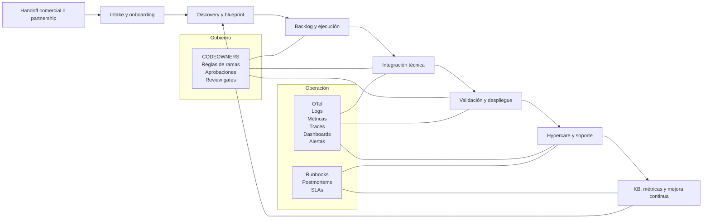
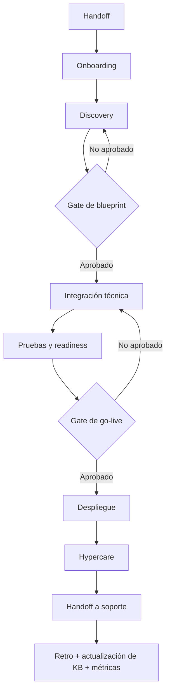

# Framework operativo para Forward Deployed Engineers

## Resumen ejecutivo

El trabajo tipo Forward Deployed Engineer no es solo “implementar software”: combina discovery con clientes, diseño de solución, configuración e integración técnica, despliegue, acompañamiento en go-live, soporte inicial y enablement del equipo del cliente. Eso se ve con claridad en cómo Palantir describe a sus FDSEs —embebidos con clientes, responsables de explorar problemas, decidir cómo desplegar la plataforma y habilitar a los equipos del cliente—, en cómo Vercel describe un rol post-sales como “technical quarterback” que coordina arquitectura, implementación y recursos, y en cómo Google Cloud presenta a sus customer engineers como el puente entre el “por qué” del cliente y el “qué/cómo” técnico. citeturn31view0turn31view1turn27view1turn31view2

Por eso, un framework de gestión para FDEs debe parecerse menos a un conjunto de documentos sueltos y más a un sistema operativo de entrega: un flujo estructurado desde handoff hasta steady state, con módulos reutilizables, plantillas consistentes, automatización del trabajo repetitivo, observabilidad desde el inicio, y gobernanza aplicada en hitos concretos. Esa lógica está alineada con marcos oficiales de adopción y excelencia operativa de Microsoft, AWS y Google, que insisten en fases estructuradas, revisiones en hitos, automatización, observabilidad y mejora continua. citeturn29view6turn35view9turn29view7turn29view8turn29view9turn27view9

La propuesta de este README es un MVP práctico y profesional del framework: ocho módulos funcionales; un modelo de roles claro; checklists paso a paso; plantillas listas para copiar; KPIs que combinan DORA, SLI/SLO, SLA y métricas de onboarding; y una arquitectura de herramientas modular, con una ruta por defecto “repo-first” y variantes para organizaciones GitHub-centric o Microsoft-centric. DORA recomienda medir desempeño de entrega con cinco métricas de throughput e inestabilidad, mientras que Google SRE recuerda que no se puede gestionar bien un servicio sin decidir qué comportamientos importan y cómo medirlos. citeturn28view8turn29view5

En términos prácticos, el MVP recomendado para una empresa B2B SaaS promedio es: repositorio como fuente de verdad, intake estandarizado, backlog enlazado a la ejecución, CI/CD con aprobaciones, observabilidad OTel-first, ITSM/knowledge base para soporte, y un ciclo de retroalimentación que convierta incidentes y fricciones de delivery en mejoras de plantilla, proceso y producto. Google Cloud recomienda procedimientos claros de respuesta a incidentes, base de conocimiento y automatización; Atlassian complementa eso con colas, formularios, SLAs, knowledge base y retros/postmortems estructurados. citeturn29view0turn29view1turn29view2turn34view6turn34view8turn38view1turn38view0

## Objetivo, alcance y principios del framework

**Objetivo del framework.** Reducir la variabilidad operativa del trabajo FDE, acortar el tiempo a primer valor y a producción, bajar el trabajo manual repetitivo, y hacer que el estado de cada cuenta o despliegue sea visible, medible y gobernable. La combinación de DORA para desempeño de entrega, SLI/SLO para salud de servicio y SLAs para soporte ofrece una base sólida para medir no solo velocidad, sino también confiabilidad y capacidad de recuperación. citeturn28view8turn29view5turn30view1

**Alcance del MVP.** Este framework cubre desde el handoff comercial o de partnership hasta el cierre de hypercare y el paso a soporte/operación continua. Incluye onboarding cliente, discovery, blueprint técnico, integración, despliegue, soporte, documentación, métricas, comunicación y mejora continua. No intenta reemplazar completamente al CRM, al ERP, al sistema legal o al PMO corporativo; su foco es el sistema operativo mínimo para que un FDE y su manager técnico puedan ejecutar y escalar entregas con disciplina. La estructura por fases está alineada con Cloud Adoption Framework y con las fases de assessment/discovery/plan/build/deploy de Microsoft, Google Cloud y AWS. citeturn29view6turn35view7turn35view8turn35view9

**Principios de diseño del MVP.**

| Principio | Traducción operativa en el framework |
|---|---|
| Enfoque en outcomes | Cada ticket y cada fase debe declarar el objetivo de negocio, el impacto esperado y el criterio de aceptación. |
| Discovery antes de construir | No se implementa sin mapa de actores, inventario, dependencias, riesgos y definición del “por qué / qué / cómo”. |
| Source of truth explícita | Todo entregable vive en un sistema trazable: repo, proyecto, ticket, KB o runbook; no en chats dispersos. |
| Automatizar el toil | Formularios, checklists, issue templates, reglas, pipelines y workflows deben absorber el trabajo repetitivo. |
| Observabilidad desde el inicio | Logs, métricas, traces, dashboards y alertas no son “fase posterior”; son parte de la definición de listo. |
| Gobernanza por defecto | Revisiones, CODEOWNERS, reglas de ramas, aprobaciones y cadencias de revisión deben existir desde el MVP. |
| Aprendizaje acumulativo | Cada incidente, ticket reabierto o retraso debe alimentar KB, runbooks, plantillas y roadmap del framework. |

Esta tabla es una síntesis operativa basada en fuentes oficiales de SRE, Cloud Adoption, Well-Architected, GitHub y Atlassian, todas consistentes en cinco ideas: claridad de objetivos, fases explícitas, automatización, medición y aprendizaje continuo. citeturn29view5turn29view6turn29view7turn29view8turn29view9turn36view2turn36view3turn37view2turn38view1

**Forma recomendada de implementarlo.** El MVP debe materializarse como un repositorio operativo y documental, no solo como una presentación. Una estructura mínima sugerida es la siguiente:

```text
fde-ops-framework/
├── README.md
├── docs/
│   ├── onboarding-cliente.md
│   ├── discovery.md
│   ├── blueprint-tecnico.md
│   ├── despliegue-y-hypercare.md
│   ├── soporte-e-incidentes.md
│   └── metricas-y-gobernanza.md
├── templates/
│   ├── ticket-intake.md
│   ├── runbook.md
│   ├── email-kickoff.md
│   ├── email-status-semanal.md
│   ├── email-incidente.md
│   ├── sow.md
│   └── cronograma.md
├── runbooks/
│   ├── deploy.md
│   ├── rollback.md
│   ├── integracion-api.md
│   └── acceso-y-secretos.md
├── governance/
│   ├── raci.md
│   ├── severity-priority-matrix.md
│   ├── review-gates.md
│   └── documentation-owners.md
├── automation/
│   ├── issue-templates/
│   ├── pull-request-template.md
│   └── workflows/
└── metrics/
    ├── kpi-catalog.md
    └── dashboards/
```

## Modelo operativo y roles

El modelo operativo propuesto asume que el FDE no trabaja solo: necesita una pequeña malla de responsabilidades que cubra negocio, entrega, plataforma, seguridad, soporte y contrapartes del cliente. Palantir describe al FDSE como alguien que participa en conversaciones iniciales, scoping, despliegue y habilitación del cliente; Vercel enfatiza el rol de coordinación técnica post-sales; Google Cloud subraya que el valor aparece cuando se conecta el problema real del cliente con la solución técnica correcta. En paralelo, Microsoft recomienda formalizar gobernanza con un equipo responsable, autoridad explícita y una matriz RACI, mientras que PagerDuty insiste en que los roles de incidente críticos deben tener una sola persona responsable para evitar propiedad difusa. citeturn31view0turn31view1turn27view1turn31view2turn35view10turn34view0

| Rol | Mandato principal | Responsabilidades operativas |
|---|---|---|
| FDE Lead | Responsable del outcome de la cuenta o implementación | Dirige onboarding, discovery, plan, dependencias, riesgos, cadencia con cliente y readiness de go-live |
| FDE | Ejecuta solución e integración | Traduce requerimientos a backlog técnico, implementa, valida, documenta y opera hypercare |
| Platform / SRE | Garantiza confiabilidad y operación | IaC, pipelines, entornos, observabilidad, rollback, runbooks, alerting |
| Engineering Manager / Delivery Manager | Quita bloqueos y gobierna capacidad | Priorización, staffing, decisiones de escalado, hitos y salud del portfolio |
| Security / Compliance | Reduce fricción regulatoria y de acceso | Revisión de accesos, secretos, approvals, cuestionarios de seguridad, políticas |
| Support / CS / Ops | Sostiene continuidad después del go-live | Quesos, SLAs, KB, handoff a operación y feedback desde tickets |
| Sponsor / Product Owner del cliente | Define prioridad y aceptación | Objetivo de negocio, decisiones de alcance, aprobación de entregables y UAT |
| Admin / IT del cliente | Habilita ejecución real | Accesos, SSO, redes, datos, ambientes, políticas internas |

**Regla práctica para incidentes críticos.** Defina desde el día uno al menos tres roles incidentales: Incident Commander, Responsable Técnico y Customer Liaison. PagerDuty muestra que es útil distribuir esos roles mediante rotaciones y que un rol crítico debe tener una sola persona asignada a la vez para promover accountability; Google SRE añade que la respuesta efectiva depende de una línea de mando clara, roles definidos y registro continuo de debugging/mitigación. citeturn34view1turn34view2turn34view0turn29view3turn29view4

## Arquitectura, módulos y stack sugerido

La arquitectura del framework debe separar claramente cuatro capas: entrada y orquestación del trabajo, ejecución técnica, operación/soporte, y gobierno/medición. Esa separación coincide con las recomendaciones de Cloud Adoption Framework, con la necesidad de inventario y dependencias antes de migrar o integrar, y con la exigencia de observabilidad e incident management maduros en operación. citeturn29view6turn35view7turn35view8turn27view9turn35view1turn35view2



**Módulos funcionales del MVP.**

| Módulo | Propósito | Salidas mínimas |
|---|---|---|
| Onboarding cliente | Alinear objetivo, actores, accesos y cadencia | ficha de cuenta, matriz de stakeholders, canales, riesgos iniciales |
| Discovery | Entender problema, inventario, dependencias y restricciones | discovery memo, mapa de dependencias, backlog inicial, criterios de aceptación |
| Blueprint e integración | Traducir discovery a diseño ejecutable | arquitectura objetivo, plan de integración, datos/secretos/accesos, plan de pruebas |
| Despliegue | Llevar la solución a entornos válidos y luego a producción | pipeline, checklist go-live, plan rollback, aprobaciones |
| Hypercare y soporte | Sostener el lanzamiento y absorber incidentes iniciales | runbooks, severity matrix, handoff soporte, incident timeline |
| Documentación y KB | Reducir escalaciones repetitivas y preservar conocimiento | troubleshooting articles, guías operativas, FAQs, known issues |
| Métricas y mejora | Medir delivery, confiabilidad y adopción | dashboard KPIs, retro, backlog de mejoras del framework |
| Comunicación | Estandarizar mensajes internos y con cliente | templates de kickoff, status, riesgos, incidentes y cierre |

La selección de módulos está directamente soportada por las prácticas oficiales de adopción, discovery, incident management, forms/workflows/queues/SLAs y knowledge base de Microsoft, Google Cloud, AWS y Atlassian. citeturn35view7turn35view8turn35view9turn29view0turn29view1turn29view2turn27view10turn30view1turn30view2turn30view3turn34view8turn34view9

**Comparativa de infraestructura y entrega.** La tabla siguiente sintetiza capacidades declaradas en la documentación oficial; las columnas de ventajas y trade-offs son una inferencia operativa razonable a partir de esos modelos de producto. citeturn28view5turn28view6turn28view7turn35view5turn36view6turn36view7turn36view8turn36view9turn36view10

| Herramienta | Mejor encaje | Ventajas | Trade-offs |
|---|---|---|---|
| OpenTofu | MVP open-source de IaC | Flujo simple write-plan-apply; archivos legibles y versionables | Requiere disciplina de estado, módulos y gobierno |
| Terraform | IaC estándar con gran ecosistema | Amplia adopción; buen encaje repo/VCS; lenguaje común | La gobernanza colaborativa depende de la edición y del modelo operativo elegido |
| Pulumi | Equipos que prefieren lenguajes de propósito general | Muy natural para developers; buen testing e integración con CI | Más flexibilidad implica más necesidad de convenciones internas |
| GitHub Actions | Organizaciones con GitHub como hub | CI/CD nativo; automation por eventos; issue ops; environments/secrets | Menor centralización que suites más opinadas si la organización es muy heterogénea |
| GitLab CI/CD | Organizaciones GitLab-first | Componentes reutilizables y catálogo para reducir duplicación | Más valor cuando repos, planning y delivery ya viven en GitLab |
| Azure Pipelines | Organizaciones Microsoft/Azure | Multi-lenguaje, multi-destino, fuerte encaje enterprise | Añade complejidad si el resto del flujo está fuera de Azure DevOps |
| Argo CD | Kubernetes + GitOps real | Declarativo, auditable, multi-tenant, fuerte para CD en K8s | No vale la pena en MVP sin Kubernetes o sin disciplina GitOps |
| Jenkins | Entornos legacy, híbridos o muy custom | Pipeline-as-code maduro, muy extensible, buen rastro de auditoría | Mayor carga de ownership de plataforma y estandarización |

**Comparativa de observabilidad.** También aquí, las ventajas y trade-offs son síntesis operativa sobre documentación oficial. citeturn28view0turn28view2turn35view3turn35view4turn28view4turn35view1turn35view2

| Opción | Mejor encaje | Ventajas | Trade-offs |
|---|---|---|---|
| OpenTelemetry + Prometheus + Grafana | Equipos que priorizan apertura y portabilidad | OTel es vendor-neutral; Prometheus resuelve monitoreo/alertas; Grafana unifica dashboards y alerting flexible | Más trabajo de plataforma y operación del stack |
| Datadog | Equipos que quieren velocidad de adopción y plataforma unificada | Cobertura muy amplia desde dev hasta operaciones; integración con OTel | Mayor dependencia de plataforma comercial |
| Google Cloud Observability | Workloads mayoritariamente en GCP | Integra observabilidad de apps e infraestructura y acelera respuesta | Más acoplamiento a ecosistema GCP |
| Azure Monitor | Azure e híbrido con fuerte base Microsoft | Reúne métricas, logs y trazas; alertas y automatización; híbrido/on-prem | Más acoplamiento a ecosistema Microsoft |

**Comparativa de gestión del trabajo, conocimiento y comunicación.** Esta comparación se apoya en documentación oficial de Jira Service Management, Linear, GitHub Projects, Azure Boards, Confluence, Notion, Slack y Teams. citeturn34view6turn34view7turn34view8turn34view9turn28view9turn28view10turn36view0turn36view11turn37view1turn37view0turn37view3turn28view11turn28view12turn30view19

| Herramienta | Mejor encaje | Ventajas | Trade-offs |
|---|---|---|---|
| Jira Service Management | Soporte, incidentes, cambios, SLAs y portal | Queues, forms, reports, channels, automatización, KB, ITSM | Más configuración y taxonomía inicial |
| Linear | Equipos de ingeniería rápidos con intake desde integraciones | Triage inbox, updates a Slack, muy buena experiencia para equipos técnicos | Menos completo en ITSM formal que JSM |
| GitHub Projects | Equipos repo-first | Tabla/board/roadmap pegado a issues y PRs | Menos opinionado para workflows de service desk |
| Azure Boards | Equipos Azure DevOps | Agile/Kanban/Scrum potente y trazabilidad con work items | Menos natural si el código vive fuera de Azure DevOps |
| Confluence | KB, runbooks, troubleshooting, documentación formal | Templates, troubleshooting articles, runbooks, administración de templates | Requiere gobernar estructura y permisos |
| Notion | Docs + tasks + intake en un mismo lugar | Docs, formularios y proyectos en un solo workspace | Menor cercanía al ciclo de revisión de código |
| Slack | Swarming operativo y automatización liviana | Workflows, pasos conectores, huddles | Si no se gobierna, dispersa contexto |
| Teams | Empresas Microsoft 365 | Flujos de trabajo, canales compartidos, muy buen encaje organizacional | Menor agilidad fuera del stack Microsoft |

**Stack por defecto recomendado para el MVP.** Si no existe una restricción previa fuerte, la opción más equilibrada para un SaaS B2B es: GitHub + GitHub Actions + Projects + issue forms + CODEOWNERS + branch protection; OpenTofu o Terraform; Argo CD solo si ya hay Kubernetes; observabilidad con OpenTelemetry y Grafana/Prometheus o Datadog según presupuesto; Jira Service Management + Confluence para soporte y conocimiento; y Slack para coordinación operativa. Si la organización es Microsoft-first, la variante natural es Azure Repos/Pipelines/Boards + Azure Monitor + Teams. citeturn35view5turn36view1turn36view2turn36view3turn36view4turn28view6turn28view5turn36view7turn28view0turn35view3turn35view4turn28view4turn34view6turn37view1turn28view11turn28view12

## Flujos de trabajo y checklists

La secuencia recomendada sigue una lógica simple: entender antes de construir, estandarizar antes de escalar y observar antes de declarar “done”. Google Cloud insiste en que discovery debe crear inventario y mapa de dependencias; AWS recomienda discovery/assessment/planning explícitos; y SRE/Google Cloud/Atlassian coinciden en respuesta clara a incidentes, KB y documentación uniforme. citeturn35view7turn35view8turn29view0turn29view1turn29view2turn38view1



**Checklist de onboarding cliente**

- [ ] Definir sponsor, product owner y administrador técnico del cliente.
- [ ] Registrar objetivo de negocio, alcance inicial y definición de éxito.
- [ ] Acordar canal oficial de coordinación y canal de escalación.
- [ ] Crear ticket maestro, proyecto y carpeta/space documental.
- [ ] Levantar prerequisitos de acceso, seguridad, entornos y datos.
- [ ] Alinear severidades, ventanas de cambio y disponibilidad de stakeholders.
- [ ] Crear borrador de SOW y cronograma base.
- [ ] Abrir registro de riesgos inicial y dependencias externas.

**Checklist de discovery**

- [ ] Obtener inventario de sistemas, integraciones, APIs, datos y owners.
- [ ] Mapear dependencias técnicas y operativas.
- [ ] Entender restricciones no funcionales: seguridad, latencia, auditoría, residencia, continuidad.
- [ ] Traducir el problema a historias o casos de uso priorizados.
- [ ] Definir criterios de aceptación y “definition of done”.
- [ ] Decidir explícitamente qué se configura, qué se construye y qué se pospone.
- [ ] Producir blueprint técnico y backlog inicial.
- [ ] Revisar blueprint en gate formal antes de ejecutar.

**Checklist de integración técnica**

- [ ] Provisionar repositorio, owners, plantillas y reglas de revisión.
- [ ] Crear o validar entornos, secretos y permisos.
- [ ] Implementar pipeline base y estrategia de despliegue.
- [ ] Definir instrumentación OTel o equivalente y dashboards mínimos.
- [ ] Preparar pruebas funcionales, de integración y smoke tests.
- [ ] Validar contratos con sistemas externos y plan de datos de prueba.
- [ ] Redactar runbook de deploy, rollback y resolución inicial.
- [ ] Estimar deuda técnica y registrar exclusiones del MVP.

**Checklist de despliegue**

- [ ] Confirmar aprobaciones técnicas, de negocio y de seguridad.
- [ ] Ejecutar dry run o despliegue en entorno espejo / staging.
- [ ] Confirmar dashboards, alertas y canales de incidente.
- [ ] Verificar readiness del equipo de soporte e hypercare.
- [ ] Comunicar ventana de cambio, impacto esperado y rollback plan.
- [ ] Ejecutar smoke tests post-deploy.
- [ ] Documentar resultados, desvíos y acción inmediata.
- [ ] Marcar inicio de hypercare con responsables y horarios definidos.

**Checklist de soporte, documentación y cierre**

- [ ] Crear artículo de troubleshooting para errores previsibles.
- [ ] Establecer SLA y severidad por tipo de incidente o solicitud.
- [ ] Registrar incidente, causa, mitigación y acciones de seguimiento.
- [ ] Ejecutar retro/postmortem sin culpa y con tickets de mejora.
- [ ] Actualizar KB, runbooks y checklist de despliegue.
- [ ] Medir tiempo a valor, tiempo a producción, defectos y reaperturas.
- [ ] Formalizar handoff a soporte o customer success.
- [ ] Cerrar SOW/hito con criterios de aceptación explícitos.

**Escenarios comunes y solución recomendada**

| Escenario | Señal típica | Respuesta del framework |
|---|---|---|
| Cliente bloquea accesos y SSO | El proyecto “no avanza” pese a que el equipo técnico ya empezó | Tratar accesos como prerequisito de onboarding, no como tarea secundaria; abrir owner explícito en cliente y gatear ejecución |
| Dependencias ocultas en sistemas legacy | Cambios aparentemente simples se frenan al integrar | Reforzar discovery con inventario y dependency map antes de prometer fechas cerradas |
| Go-live sin observabilidad | Se despliega, pero no hay forma rápida de detectar degradación | Exigir dashboard, alertas y runbook como condición de readiness |
| Mucho ticket repetido tras lanzamiento | Soporte atiende siempre lo mismo y escala de más | Convertir causas frecuentes en KB, troubleshooting article y mejoras de formulario/intake |
| Incidente crítico con demasiadas voces | Nadie sabe quién decide ni quién comunica | Asignar Incident Commander, Responsable Técnico y Customer Liaison de forma explícita |

Estos escenarios reflejan patrones que las fuentes oficiales repiten: discovery temprano, procedimientos claros de incidente, base de conocimiento, y documentación uniforme que conecte respuesta, análisis retrospectivo y acciones de seguimiento. citeturn35view7turn29view0turn29view1turn29view2turn38view1turn38view0turn34view1turn34view2

## Plantillas MVP

Las plantillas siguientes están pensadas para ser copiadas a GitHub, Jira, Confluence, Notion o el repositorio documental del framework. GitHub soporta issue forms y PR templates; Confluence soporta templates personalizados, runbooks y troubleshooting articles; Jira Service Management usa forms, workflows y request types; y Atlassian recomienda documentar incidentes y retros de manera uniforme para conectar respuesta y aprendizaje. citeturn36view1turn37view1turn29view13turn36view13turn34view6turn34view9turn38view1

```md
# Template de ticket de intake FDE

## Datos de cuenta
- Cliente:
- Sponsor:
- Product owner:
- Admin técnico:
- Tipo de engagement: onboarding / discovery / integración / despliegue / soporte

## Objetivo de negocio
- Problema que se quiere resolver:
- KPI de negocio afectado:
- Fecha objetivo:
- Riesgo si no se resuelve:

## Contexto técnico
- Producto / módulo involucrado:
- Sistemas externos:
- Datos / APIs:
- Requisitos de seguridad:
- Entornos necesarios:

## Definición de éxito
- Criterios de aceptación:
- Evidencia esperada:
- Stakeholder que valida:

## Riesgos y dependencias
- Riesgo principal:
- Dependencias externas:
- Bloqueadores actuales:

## Próximo paso
- Owner:
- Fecha:
- Entregable:
```

```md
# Template de runbook operativo

## Propósito
Qué resuelve este runbook y cuándo debe usarse.

## Alcance
Servicios, módulos, entornos y exclusiones.

## Señales de activación
Alertas, síntomas, queries, logs o reportes del cliente.

## Diagnóstico rápido
1. Verificar dashboard principal.
2. Confirmar estado de dependencias.
3. Revisar errores recientes y cambios desplegados.
4. Clasificar severidad e impacto.

## Mitigación inmediata
- Acción A
- Acción B
- Acción C

## Rollback
- Criterio para ejecutar rollback
- Pasos exactos
- Validación posterior

## Escalación
- Incident Commander:
- Responsable técnico:
- Customer Liaison:
- Canal de war room:
- Tiempo máximo antes de escalar:

## Validación de cierre
- Smoke test:
- KPI normalizado:
- Confirmación del cliente:
- Ticket / incidente relacionado:
```

```txt
Asunto: [Kickoff] <Cliente> — objetivos, alcance y próximos pasos

Hola <nombre>,

Gracias por la sesión de inicio. Confirmamos:
- Objetivo de negocio:
- Alcance del MVP:
- Equipos involucrados:
- Riesgos/prerrequisitos:
- Próximo hito y fecha:

Adjuntamos/compartimos:
- SOW borrador
- Cronograma inicial
- Lista de accesos requeridos
- Canal de comunicación oficial

Saludos,
<owner FDE>
```

```txt
Asunto: [Status semanal] <Cliente> — avances, riesgos y siguiente hito

Resumen ejecutivo:
- Estado general: verde / amarillo / rojo
- Avance de la semana:
- Riesgos / bloqueos:
- Decisiones requeridas del cliente:
- Próximo hito:
- Fecha:

Detalle:
- Entregables completados
- Entregables en curso
- Cambios al alcance
- Acciones pendientes por owner
```

```txt
Asunto: [Incidente] <Cliente> — actualización <Sev-X>

Estado actual:
- Severidad:
- Impacto:
- Hora de inicio:
- Servicio afectado:
- Mitigación en curso:
- Próxima actualización a las <hora>

Acciones realizadas:
- ...
- ...

Requerimientos del cliente / próximos pasos:
- ...
```

```md
# Template de SOW para engagement FDE

## Objetivo
## Alcance incluido
## Alcance excluido
## Entregables
## Supuestos
## Dependencias del cliente
## Roles y responsabilidades
## Criterios de aceptación
## Riesgos y mitigaciones
## Seguridad, accesos y cumplimiento
## Cronograma e hitos
## Modelo de soporte y hypercare
## Gestión de cambios
## Firma / aprobación
```

| Semana | Hito | Owner | Dependencias | Criterio de salida |
|---|---|---|---|---|
| 1 | Kickoff y onboarding | FDE Lead | sponsor y accesos | ficha de cuenta y canales definidos |
| 2 | Discovery terminado | FDE + cliente | inventario y stakeholders | blueprint aprobado |
| 3-4 | Integración base | FDE + Platform | entornos y secretos | pipeline y observabilidad activos |
| 5 | UAT / readiness | FDE + PO cliente | casos de prueba | checklist go-live completo |
| 6 | Go-live + hypercare | FDE + soporte | aprobaciones | servicio estable y handoff iniciado |

## Métricas, gobernanza, adopción y roadmap

El catálogo de métricas del framework debe mezclar tres niveles: desempeño de entrega, confiabilidad operativa y adopción real del cliente. DORA recomienda cinco métricas de software delivery; Google SRE recomienda explicitar SLI/SLO/SLA antes de medir salud; Jira Service Management enfatiza SLAs, reports y queues; y Google Cloud y Atlassian resaltan el valor de KB y de la automatización para reducir escalaciones y mejorar eficiencia. citeturn28view8turn29view5turn30view1turn34view7turn29view1turn29view2

| KPI | Qué mide | Objetivo inicial sugerido | Owner |
|---|---|---|---|
| Tiempo a kickoff | Días desde handoff hasta kickoff formal | ≤ 5 días hábiles | FDE Lead |
| Tiempo a primer valor | Días hasta primera capacidad útil para el cliente | ≤ 30 días | FDE Lead |
| Tiempo a producción | Días hasta primer go-live | ≤ 45–60 días | FDE Lead + Platform |
| Change lead time | Tiempo commit-to-prod | Medir semanalmente; reducir de forma continua | Platform |
| Deployment frequency | Ritmo de despliegue | Medir por servicio; buscar estabilidad y no solo volumen | Platform |
| Failed deployment recovery time | Tiempo de recuperación tras despliegue fallido | P1/P2 con meta explícita; iniciar con < 4 h | Platform / Incident Commander |
| Change fail rate | % de cambios que causan reversa/hotfix/incidente | < 15% como punto de partida | Engineering / Platform |
| Cumplimiento de SLA | % de tickets dentro de objetivo | > 95% | Support / Ops |
| MTTA | Tiempo medio hasta atención inicial | < 15 min en incidentes críticos | Support / On-call |
| Reapertura de tickets | Calidad real de resolución | < 10% | Support |
| Deflexión por KB | % de dudas resueltas sin escalar a humano | +20% en el primer ciclo de mejora | Support / Docs |
| Frescura documental | % de docs revisadas en ventana definida | > 90% | Dueños de templates / KB |

**Gobernanza mínima del framework.** La gobernanza no debe ser un “comité ornamental”; Microsoft la define como un proceso continuo con equipo dedicado, autoridades claras, revisión de cumplimiento y uso explícito de RACI. AWS recomienda revisiones arquitectónicas en hitos del ciclo de vida —al inicio del diseño y antes del go-live—, y GitHub/Azure DevOps ofrecen controles concretos como CODEOWNERS, branch protection, required reviews, status checks, linked work items y environment approvals. Para incidentes, Google SRE y PagerDuty muestran que roles claros, escalación y coordinación importan más que la cantidad de herramientas. citeturn35view10turn29view9turn36view2turn36view3turn36view4turn36view12turn29view3turn29view4turn34view3

**Cadencia recomendada de gobernanza y escalado.**

| Cadencia | Reunión / control | Participantes | Salida |
|---|---|---|---|
| Diario durante delivery activo | Daily de delivery / blockers | FDE, Platform, owner cliente | bloqueos y próximas 24 h |
| Semanal | Status review con cliente | FDE Lead, sponsor, PO cliente | estado, riesgos, decisiones |
| Fin de discovery | Gate de blueprint | FDE Lead, Platform, Security, manager | aprobar / corregir blueprint |
| Pre go-live | Gate de readiness | FDE, Platform, Support, PO cliente | autorización de despliegue |
| Post incidente / post go-live | Retro / postmortem | equipo extendido | acciones de mejora en backlog |
| Mensual | Framework review | managers técnicos + owners de módulo | mejora de plantillas, KPIs y tooling |

**Plan de adopción y capacitación.** Un MVP de este tipo se adopta mejor en un piloto de 90 días con una sola cuenta o squad. La lógica no es “documentar todo primero”, sino instalar la estructura mínima, ejecutarla con un caso real, medirla y corregirla. Hay recursos oficiales útiles para entrenamiento por herramienta: Atlassian mantiene rutas de aprendizaje para Jira Service Management; Microsoft Learn cubre GitHub Actions y buenas prácticas de CI/CD; Google Cloud ofrece rutas de formación para cloud/application development; y GitHub Skills recomienda contenidos cortos, consistentes y orientados a objetivos claros. citeturn38view2turn38view3turn38view4turn38view5turn24search7turn39search1turn39search0

| Horizonte | Qué implementar | Capacitación sugerida | Resultado esperado |
|---|---|---|---|
| Días 0–30 | Repo, templates, RACI, intake, proyecto piloto, reglas de revisión | Bootcamp interno de 2–3 sesiones sobre intake, discovery, docs y CI/CD | Primer engagement ejecutado con source of truth única |
| Días 31–60 | Observabilidad mínima, gates de blueprint/go-live, runbooks, métricas base | Taller práctico de dashboards, incidentes y KB | Primera línea base de KPIs y soporte |
| Días 61–90 | Automatización, postmortems, mejora de formularios y KB, dashboards ejecutivos | Formación por rol: FDE, Support, Platform, manager | Framework listo para replicarse en más cuentas |

**Roadmap de evolución después del MVP.**

- **Fase de estandarización.** Consolidar nomenclaturas, severidades, tipos de request, labels y taxonomía documental.
- **Fase de industrialización.** Automatizar issue intake, approvals, change calendars, handoff a soporte, recordatorios de status y freshness de documentación.
- **Fase de escalado.** Añadir scorecards por cuenta, portfolio dashboard, playbooks por vertical y benchmarking entre squads.
- **Fase de inteligencia.** Clasificación automática de tickets, sugerencias de KB, generación asistida de runbooks y detección de riesgos recurrentes.

## Riesgos, esfuerzo y mantenimiento

El principal riesgo de un framework FDE no es “falta de teoría”, sino exceso de complejidad en el primer mes. Las fuentes consultadas apuntan a lo contrario: discovery concreto, herramientas y plantillas reutilizables, automatización de tareas repetitivas, documentación uniforme, base de conocimiento y gobernanza continua. El mantenimiento, por tanto, debe ser liviano, con ownership claro y revisiones periódicas, no un rediseño perpetuo. citeturn35view9turn29view7turn29view1turn29view2turn37view2turn38view1

| Riesgo | Impacto | Mitigación propuesta |
|---|---|---|
| El framework nace demasiado pesado | Baja adopción | Limitar MVP a una cuenta piloto, 8 módulos y pocas plantillas obligatorias |
| Discovery superficial | Retrabajo y fechas poco confiables | Gate formal de blueprint antes de comprometer fechas de despliegue |
| Demasiadas herramientas | Fragmentación de contexto | Elegir una fuente primaria por dominio: repo, ticketing, KB, chat |
| Sin observabilidad mínima | Hypercare reactivo y lento | Dashboard + alertas + runbook como requisito de go-live |
| Ownership difuso | Bloqueos y escalaciones tardías | RACI explícita + single owner en incidentes críticos |
| Documentación obsoleta | Soporte ineficiente | Métrica de frescura documental + revisión mensual |
| Automatización prematura de caos | Flujos opacos y frágiles | Automatizar solo después de ejecutar manualmente al menos 1–2 ciclos |
| Resistencia cultural | “Volver al chat y Excel” | Entrenamiento corto, quick wins visibles y métricas de valor |

**Estimación de esfuerzo para implementar el MVP.** Esta es una estimación de referencia para diseñar e instalar el framework, no para ejecutar un proyecto cliente adicional. Debe ajustarse según stack existente, grado de compliance y madurez del equipo.

| Paquete de trabajo | Horas estimadas | Roles principales |
|---|---:|---|
| Diseño del framework, alcance y RACI | 20–30 h | FDE Lead, manager técnico |
| Repositorio, estructura documental y README | 16–24 h | FDE Lead |
| Templates de tickets, runbooks, emails, SOW y cronograma | 20–32 h | FDE, owner documental |
| Configuración de issue/project workflows | 24–40 h | FDE, Platform |
| Reglas de revisión, approvals y controles de despliegue | 16–32 h | Platform, Security |
| Observabilidad mínima y dashboards base | 24–40 h | Platform / SRE |
| Setup de JSM/KB o equivalente | 20–32 h | Support / Ops, FDE |
| Dashboard de KPIs y scorecard del piloto | 12–20 h | FDE Lead, manager |
| Capacitación, piloto y retro del primer ciclo | 28–50 h | FDE Lead, manager, Support |

**Total recomendado para el MVP:** **180–300 horas**.

**Roles mínimos para ese esfuerzo:**

- **1 FDE Lead** como owner del framework y del piloto.
- **1 FDE / engineer de implementación** para convertir módulos en plantillas y flujos reales.
- **1 Platform / SRE part-time** para CI/CD, entornos y observabilidad.
- **1 manager técnico o delivery manager part-time** para decisión y gobernanza.
- **1 referente de Support / CS / Ops part-time** para SLAs, KB y handoff.
- **1 reviewer de Security / Compliance part-time** si hay requisitos regulatorios o enterprise.

**Mantenimiento del framework.** Mantenga un backlog del propio framework, un owner por módulo, revisión mensual de métricas y revisión trimestral de plantillas. Toda mejora relevante debe terminar en una de cuatro salidas: cambio de plantilla, cambio de automatización, cambio de checklist o cambio de métrica. Si no termina en alguna de esas cuatro, probablemente no está cerrando el loop de aprendizaje. Esa lógica coincide con la mejora continua promovida por Google Cloud, Google SRE, AWS Well-Architected y Atlassian postmortems. citeturn27view9turn29view1turn29view2turn27view6turn38view1

**Limitaciones abiertas.** Este README asume un contexto B2B SaaS genérico y no fija una nube, un sistema de identidad, un modelo regulatorio ni una herramienta única de ticketing. Si su organización ya es profundamente Microsoft-first, GitLab-first o Atlassian-first, conviene adaptar el stack recomendado a esa realidad en lugar de imponer un stack “ideal”. Si no usan Kubernetes, Argo CD no debe entrar en el MVP. Si el volumen de soporte es bajo, se puede empezar con GitHub Projects o Linear y postergar un service desk más completo. Esas son decisiones de encaje operativo, no de principio.

**Recursos clave para extender el framework.**

- Microsoft Cloud Adoption Framework y gobernanza de nube. citeturn29view6turn35view10
- Google SRE sobre SLOs e incident response. citeturn29view5turn29view3turn29view4
- AWS Well-Architected sobre excelencia operativa y review gates. citeturn29view8turn29view9
- Jira Service Management y Confluence para queues, forms, SLAs, KB, runbooks y postmortems. citeturn27view10turn30view1turn29view13turn36view13turn38view1
- GitHub para actions, projects, issue forms, CODEOWNERS y branch protections. citeturn35view5turn36view0turn36view1turn36view2turn36view3turn36view4
- OpenTelemetry, Prometheus, Grafana, Datadog y DORA para observabilidad y métricas de delivery. citeturn28view0turn28view2turn35view3turn35view4turn28view4turn28view8
